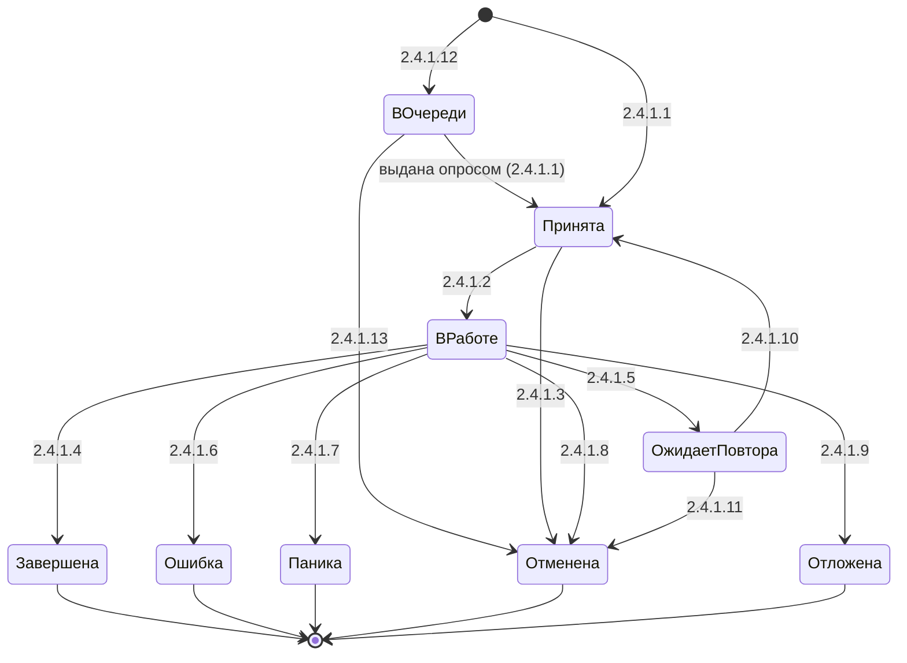
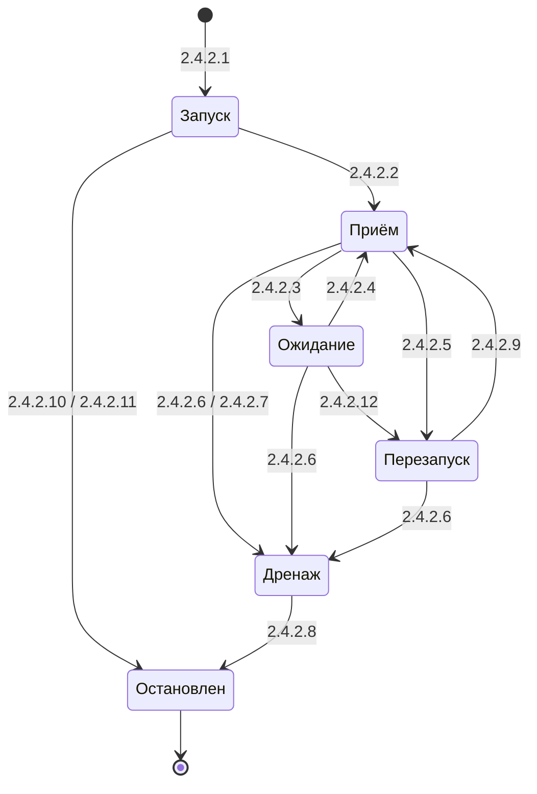

# Спецификация на taskcraft

Версия спецификации - 0.20 (проект: спецификация задаёт целевое поведение первой версии; что уже реализовано — в таблице «Статус реализации», раздел 1.1)

<!-- TOC -->
* [1. Общие сведения](#1-общие-сведения)
  * [1.1. Назначение и контекст](#11-назначение-и-контекст)
  * [1.2. Глоссарий доменных терминов](#12-глоссарий-доменных-терминов)
  * [1.3. Инварианты](#13-инварианты)
* [2. Функциональные требования](#2-функциональные-требования)
  * [2.1. Сценарии использования и обработчики](#21-сценарии-использования-и-обработчики)
    * [2.1.1. Типовой флоу потребителя](#211-типовой-флоу-потребителя)
    * [2.1.2. Обработчики по триггерам](#212-обработчики-по-триггерам)
  * [2.2. Альтернативные и ошибочные сценарии](#22-альтернативные-и-ошибочные-сценарии)
  * [2.3. Правила и логика обработки](#23-правила-и-логика-обработки)
  * [2.4. Состояния и переходы (FSM)](#24-состояния-и-переходы-fsm)
  * [2.5. API](#25-api)
  * [2.6. Интеграции](#26-интеграции)
  * [2.7. Модели данных](#27-модели-данных)
  * [2.8. Требования к конфигурации](#28-требования-к-конфигурации)
  * [2.9. Логирование](#29-логирование)
  * [2.10. Валидация входящих значений](#210-валидация-входящих-значений)
  * [2.11. Обработка ошибок](#211-обработка-ошибок)
  * [2.12. Хедеры и метаданные](#212-хедеры-и-метаданные)
* [3. Критерии приёмки](#3-критерии-приёмки)
* [4. Нефункциональные требования](#4-нефункциональные-требования)
  * [4.1. Безопасность](#41-безопасность)
  * [4.2. Производительность](#42-производительность)
  * [4.3. Надёжность](#43-надёжность)
  * [4.4. Наблюдаемость](#44-наблюдаемость)
  * [4.5. Аудит](#45-аудит)
<!-- TOC -->

---

## 1. Общие сведения

### 1.1. Назначение и контекст

**taskcraft** — библиотека фоновых задач для языка Rust на асинхронном
исполнителе tokio. Публикуется на crates.io: ядро — пакет `taskcraft`,
источники и хранилища — отдельными пакетами (`taskcraft-kafka` и другие).

Библиотека берёт единицы работы (задачи) из источника, доставляет их
обработчику, ограничивает число одновременно выполняющихся задач, повторяет
неудачные попытки, отвечает на запросы о статусе и отмене задачи по её
идентификатору, восстанавливает работу после рестарта и публикует
стандартный набор метрик.

Это **библиотека, а не сервис**: у неё нет своего процесса, сетевого API и
конфигурационного файла. «Потребитель» — приложение, которое подключает
библиотеку и объявляет в ней очереди и обработчики. Разделы шаблона,
рассчитанные на сетевой сервис, адаптированы: «API» описывает программный
интерфейс (2.5), «Хедеры» — метаданные задачи (2.12), «Аудит» не применим
(4.5).

**Граница ответственности.** Библиотека доставляет работу, ограничивает её,
хранит, повторяет и восстанавливает. Многошаговым процессом она не владеет:
внешние события в идущий процесс, ветвления по состоянию и решение «что
делать дальше» остаются за конечным автоматом (библиотека statecraft-fsm той
же семьи). Задача библиотеки может запустить автомат и получить его исход
(правило 2.3.21), но собственного механизма многошаговых процессов в
библиотеке нет.

**Происхождение.** Форма библиотеки заимствована у открытой библиотеки
apalis: маленький интерфейс источника на опросе, задача как сервис в модели
tower, всё остальное — слои. Кодовая база apalis не используется. Семантика
ключевых контрактов переопределена так, чтобы закрыть известные дефекты
этой формы: необратимое завершение воркера на «пустом» источнике,
неработающая классификация «не повторять», гибель воркера от одного
нечитаемого сообщения, повторы, удерживающие слот, остановка, ждущая конца
сна (правила 2.3.1, 2.3.2, 2.3.13, 2.3.5, 2.3.24).

**Первый потребитель** — набор сервисов обработки данных. Задания приходят
в них из Kafka, выполняются от секунд до шести часов, большую часть времени
ожидая внешнего ответа. Работа ограничивается именованными пулами ресурсов,
внешняя система запрашивает статус и отмену задания по его идентификатору,
после рестарта незавершённые задания поднимаются из базы данных. Каждое
требование этой спецификации подтверждено кодом, который первый потребитель
сейчас пишет вручную. Требования первого потребителя обязательны для первой
версии.

**Режимы работы.** По умолчанию состояние задач живёт в памяти процесса, а
долговременное хранение и восстановление — дело потребителя через хуки
(правила 2.3.18, 2.3.19). Возможности сборки добавляют:

| Возможность | Что даёт |
|-------------|----------|
| Хранилище задач | Источник, который хранит задачи вне процесса: постановка, статус, история попыток, отложенный повтор, восстановление без хуков потребителя. Очередь с хранилищем использует его как свой источник (2.6) |
| Аренда | Возможность пакета хранилища, без него не существует. Задачу может взять любой процесс, при падении процесса её подхватывает другой по истечении аренды (правило 2.3.20) |
| Интеграция с statecraft | Готовая реализация «запускаемого» для автоматов statecraft-fsm (правило 2.3.21) |
| Адаптер метрик | Публикация стандартных метрик через фасад `metrics` (правило 2.3.22) |

Ядро без включённых возможностей не зависит ни от Kafka, ни от СУБД, ни от
библиотеки метрик (инвариант 1.3.14).

**Статус реализации.** Версия 0.1 задаёт целевое поведение первой версии;
кода пока нет. Реализация разбита на заявки `openspec/changes/*`. Заявка не
меняет поведение, описанное здесь, а реализует перечисленные разделы; при
вливании заявки (`/opsx-apply`) её строка отмечается как реализованная.

| Заявка | Разделы спецификации | Статус |
|--------|----------------------|--------|
| `bootstrap-workspace` | 2.6 (параметры поставки), 2.3.23 п. 3, 4.1 пп. 1, 5 | реализовано (2026-10-05) |
| `task-model-and-lifecycle` | 1.2, 2.4.1, 2.7.1–2.7.4, 2.3.17, 2.11.4 | реализовано (2026-10-06) |
| `source-contract` | 2.3.1, 2.3.9, 2.3.10, 2.5 «Источник», 2.6 «In-memory источник» | реализовано (2026-10-06) |
| `handler-error-classification` | 2.3.2, 2.5 «Обработчик», 2.2.11 | реализовано (2026-10-06) |
| `test-harness` | 4.3 п. 8, 4.2 | реализовано (2026-10-06) |
| `worker-loop-and-supervision` | 2.4.2, 2.3.12–2.3.14, 2.1.2.2–2.1.2.8, 2.1.2.11, 2.1.2.12, 2.1.2.16, 2.1.2.17, 2.7.6 | реализовано (2026-10-06) |
| `interruptible-poll-strategies` | 2.3.24 | реализовано (2026-10-06) |
| `overflow-policy-and-resource-pools` | 2.3.7, 2.3.8, 2.2.1, 2.2.2 | реализовано (2026-10-06) |
| `retry-policy` | 2.3.3–2.3.6, 2.1.2.9, 2.1.2.10 | реализовано (2026-10-06) |
| `task-registry` | 2.3.11, 2.3.15, 2.1.2.1, 2.1.2.14, 2.1.2.15 | реализовано (2026-10-06) |
| `ownership-and-recovery` | 2.3.16, 2.3.18, 2.3.19 п. 3, 2.1.2.13, 2.2.8, 2.2.12 | реализовано (2026-10-06) |
| `kafka-source` | 2.6 «Источник Kafka», 2.8 «Источник Kafka», 2.12 | реализовано (2026-10-06) |
| `statecraft-integration` | 2.3.21 | реализовано (2026-10-06): контракт и адаптер «в нынешнем виде»; общая реализация — после изменения statecraft-fsm |
| `observability` | 2.3.22, 2.9, 4.4 | реализовано (2026-10-06); события аренды — с `durable-task-store` |
| `no-panics-in-library` | 1.3.19, 4.3 п. 9, критерий №49 | реализовано (2026-10-06) |
| `durable-task-store` | 2.6 «Хранилище», 2.7.5, 2.3.19 пп. 1–2, 5, 2.3.20, 2.3.25, 2.1.2.18, 2.2.9 | реализовано (2026-10-06): пакет `taskcraft-postgres` |
| `consumer-scenarios` | раздел 3 целиком (сводная проверка) | реализовано (2026-10-06): таблица покрытия — в архиве заявки |
| `examples-catalog` | документация: каталог примеров, поведения не меняет | реализовано (2026-10-06): каталог `examples/README.md`, E-1…E-15 |

### 1.2. Глоссарий доменных терминов

| Термин | Синонимы | Определение |
|--------|----------|-------------|
| Задача | Task | Единица работы: идентификатор, аргументы, метаданные, номер попытки. Проходит жизненный цикл 2.4.1 |
| Терминальный статус | Final state | Состояние задачи, из которого нет переходов: «Завершена», «Ошибка», «Паника», «Отменена» (2.4.1) |
| Идентификатор задачи | Task id | Строка, уникальная в пределах очереди. Задаётся потребителем при постановке либо выводится источником из сообщения; если не задан — генерируется библиотекой (UUID v4). По нему работают статус, отмена и идемпотентный приём (правило 2.3.11) |
| Аргументы задачи | Args, полезная нагрузка | Типизированные данные задачи. Тип аргументов один на очередь |
| Метаданные задачи | Metadata, расширения | Набор значений, ключуемых их типом. У задач разных сценариев разный набор. Не путать с аргументами: аргументы — «что сделать», метаданные — сопутствующие сведения (трассировка, приоритет, сведения о получателе) |
| Тип метаданных | Metadata type | Тип значения метаданных. У задачи не больше одного значения каждого типа |
| Реестр типов метаданных | Metadata registry | Соответствие «тип метаданных → стабильное имя и правило кодирования». Нужен только очередям, которые хранят задачи вне процесса (правило 2.3.17) |
| Очередь | Queue | Именованный канал задач одного типа аргументов: источник, обработчик, лимит конкурентности, политика переполнения, момент ack, политика повторов |
| Источник | Source, backend | Откуда очередь берёт задачи и куда подтверждает их обработку. Опрашивается воркером (правило 2.3.1) |
| Табличный источник | Table source | Источник с поштучным подтверждением: каждая задача подтверждается независимо от других (хранилище задач, in-memory источник) |
| In-memory источник | Memory source | Табличный источник в памяти процесса, входит в ядро. Принимает постановку, ограничен по ёмкости (2.8), поддерживает отложенный повтор, не переживает процесс |
| Журнальный источник | Log source | Источник со смещениями: подтверждение задачи — фиксация смещения, которая подтверждает и все предыдущие задачи раздела журнала (Kafka) |
| Раздел журнала, смещение | Partition, offset | Раздел — упорядоченная последовательность сообщений журнального источника; смещение — номер сообщения в разделе |
| Возможности источника | Source capabilities | Объявляемый источником набор: приём постановки, поштучный ack, отложенный повтор, транзакционный ack. От него зависят правила 2.3.6, 2.3.10 и обработчик 2.1.2.1 |
| Кодек | Codec | Правило перевода сообщения источника в задачу (аргументы, идентификатор, метаданные) и обратно. По умолчанию — JSON |
| Пробуждение источником | Wake-up | Сигнал источника воркеру в «Ожидании»: появилась задача, можно опрашивать не дожидаясь конца сна |
| Стратегия опроса | Poll strategy | Правило, сколько спать после ответа «сейчас пусто» (правило 2.3.24) |
| Опрос источника | Poll | Запрос следующей задачи. Ответ — одно из трёх: «есть задача», «сейчас пусто», «закрыт» (правило 2.3.1) |
| Ack | Подтверждение | Сообщение источнику, что задача принята в работу или завершена: удаление строки, пометка, фиксация смещения |
| Момент ack | Ack point | Когда выполняется ack: «после приёма на учёт» либо «после завершения» (правило 2.3.9) |
| Приём на учёт | Accept | Момент, когда задача, полученная опросом источника, записана в реестр задач (переход 2.4.1.1). Постановка из кода задачу на учёт не принимает: она пишет задачу в источник |
| Захват задачи | Claim | Для хранилища: атомарная запись «эта задача у этого процесса», выполняемая при выдаче задачи опросом и при подхвате по аренде |
| Обработчик | Handler | Функция потребителя, исполняющая задачу. Получает аргументы и извлекаемые значения и возвращает исход |
| Извлекаемое значение | Extractor | Значение, которое обработчик объявляет параметром и библиотека подставляет сама: метаданные, номер попытки, идентификатор, признак отмены, общие данные |
| Общие данные | Shared data | Значения потребителя, общие для всех задач очереди (клиенты, пулы соединений), передаваемые обработчику как извлекаемое значение |
| Исход обработчика | Outcome | Одно из: «успех», «повторить» (Retry), «прервать» (Abort), «отложить» (Defer). Классификация — данные, а не тип ошибки (правило 2.3.2) |
| Паника | Panic | Аварийное завершение обработчика. Перехватывается и становится терминальным исходом «паника» (правило 2.3.2) |
| Попытка | Attempt | Один запуск обработчика для задачи. Номер первой попытки — 1 |
| Политика повторов | Retry policy | Максимальное число попыток и расчёт паузы между ними (правила 2.3.3, 2.3.4) |
| Пауза повтора | Retry pause | Ожидание перед следующей попыткой. Прерывается остановкой и отменой (инвариант 1.3.7) |
| Отложенный повтор | Defer | Возврат задачи в источник с задержкой. Требует возможности источника, иначе выполняется как повтор в процессе (правило 2.3.6) |
| Слот конкурентности | Slot | Одна единица лимита конкурентности очереди. Выполняющаяся задача занимает ровно один слот |
| Лимит конкурентности | Concurrency limit | Число слотов очереди |
| Политика переполнения | Overflow policy | Поведение при отсутствии свободного слота: «ждать» или «отказать» (правило 2.3.7) |
| Лимит ожидания слота | Wait limit | Сколько принятых задач может ждать слот при политике «ждать» (сценарий 2.2.2) |
| Хук отказа | Reject hook | Функция потребителя, вызываемая при отказе по переполнению. Формирует ответ отправителю |
| Пул ресурсов | Resource pool | Именованный ограниченный ресурс процесса со своим размером («слот распаковки»). Общий для всех очередей процесса (правило 2.3.8) |
| Разрешение пула | Permit | Одна занятая единица пула. Освобождается при любом исходе задачи (инвариант 1.3.6) |
| Воркер | Worker | Цикл приёма одной очереди: опрашивает источник и передаёт задачи на исполнение. Жизненный цикл 2.4.2 |
| Монитор | Monitor | Владелец воркеров процесса: запускает их, перезапускает после сбоя, останавливает |
| Супервизия | Supervision | Перезапуск цикла приёма после ошибки с задержкой (правило 2.3.12). Включена по умолчанию |
| Сигнал остановки | Shutdown signal | Общий для процесса признак «пора останавливаться». Будит всех ждущих (правило 2.3.14) |
| Таймаут остановки | Shutdown timeout | Время, которое выполняющиеся задачи получают на завершение после сигнала остановки |
| Итог остановки | Shutdown report | Сводка, которую монитор возвращает после остановки (модель 2.7.6) |
| Отмена | Cancel | Запрос прекратить конкретную задачу. Кооперативная: обработчик видит признак отмены; по истечении льготного времени — принудительное прерывание (правило 2.3.15) |
| Льготное время отмены | Cancel grace | Сколько задача может завершаться после признака отмены до принудительного прерывания |
| Таймаут задачи | Task timeout | Предельная длительность одной попытки. По умолчанию не задан (правило 2.3.16) |
| Реестр задач | Task registry | Набор задач очереди, принятых на учёт и ещё не достигших терминального статуса. Без хранилища живёт в памяти процесса |
| Владелец задачи | Owner | Процесс, принявший задачу на учёт. С хранилищем владелец записан в хранилище под стабильным идентификатором процесса (2.8). Без аренды владелец не меняется |
| Сирота | Orphan | Задача, числящаяся у потребителя или в хранилище «в работе», владельца которой нет. Без аренды — задача прежнего запуска этого же процесса, которой нет в его реестре; с арендой — задача с истёкшей арендой (правило 2.3.19) |
| Хук восстановления | Recovery hook | Функция потребителя, вызываемая при старте монитора до начала приёма. Возвращает задачи для повторной постановки (правило 2.3.18) |
| Отравленное сообщение | Poison message | Сообщение источника, которое невозможно декодировать в задачу. Повтор не поможет |
| Хук dead-letter | Dead-letter hook | Функция потребителя, получающая отравленное сообщение и причину. По умолчанию сообщение пишется в журнал и подтверждается (правило 2.3.13) |
| Транзиентная ошибка источника | Transient source error | Сбой источника (сеть, СУБД), который может пройти сам. Ведёт к перезапуску цикла приёма, а не к отказу задачи |
| Хранилище задач | Task store | Табличный источник отдельного пакета, хранящий задачи вне процесса (первая реализация — PostgreSQL) |
| Аренда | Lease | Возможность пакета хранилища: право процесса на задачу до момента истечения, продлеваемое heartbeat'ом |
| Heartbeat | Продление аренды | Периодическое продление аренды владельцем |
| Запускаемое | Runnable | Расширяемый контракт «запустить, отменить, дождаться исхода». Обработчик может вернуть запускаемое вместо немедленного исхода (правило 2.3.21) |
| Наблюдатель | Observer | Контракт получателя событий библиотеки (приём, отказ, исход, повтор, паника, длительность). Основа метрик (правило 2.3.22) |
| Возможность сборки | Feature | Включаемая при сборке часть библиотеки со своими зависимостями |

### 1.3. Инварианты

1. **ВСЕГДА** ответ «сейчас пусто» при опросе источника оставляет воркер в
   работе; завершает цикл приёма только ответ «закрыт» либо сигнал остановки
   (правило 2.3.1; переходы 2.4.2.3, 2.4.2.6; критерии №1, №2).
2. **НИКОГДА** воркер не завершается молча: каждое завершение и каждый
   перезапуск цикла приёма сопровождаются записью в журнал с причиной и
   событием наблюдателя (правила 2.3.1, 2.3.12; критерии №2, №9).
3. **НИКОГДА** одно отравленное сообщение не останавливает цикл приёма
   (правило 2.3.13; критерий №8).
4. **НИКОГДА** задача с исходом «прервать» или «паника» не запускается
   повторно, в том числе когда исход пришёл в виде упакованной ошибки
   (правило 2.3.2; критерии №5, №6).
5. **ВСЕГДА** число исходов «повторить», после которых задача запускалась
   снова, не превышает максимального числа попыток минус один, а номер
   попытки растёт на 1 начиная с 1 (правило 2.3.3; критерий №11).
6. **ВСЕГДА** слот конкурентности и все разрешения пулов, занятые задачей,
   освобождаются при любом исходе: успех, ошибка, паника, отмена, таймаут,
   остановка (правила 2.3.5, 2.3.8; критерий №15).
7. **НИКОГДА** сон — пауза повтора, ожидание между опросами, задержка
   перезапуска — не задерживает остановку и отмену: сигнал прерывает его
   немедленно (правила 2.3.14, 2.3.24; критерии №12, №20).
8. **НИКОГДА** в реестре очереди нет двух задач с одинаковым идентификатором;
   повторная постановка задачи с занятым идентификатором возвращает «уже
   ведётся» и не порождает второй задачи (правило 2.3.11; критерий №17).
9. **ВСЕГДА** задача, достигшая терминального статуса, удаляется из реестра в
   памяти; реестр не растёт без ограничения (правило 2.3.11; критерий №18).
10. **НИКОГДА** ack не выполняется раньше момента, заданного очередью
    (правило 2.3.9; критерии №22, №23, №39).
11. **НИКОГДА** значение метаданных, которое не удалось разобрать, не
    подменяется значением по умолчанию: это ошибка задачи (правило 2.3.17;
    критерий №27).
12. **ВСЕГДА** паника обработчика становится терминальным исходом «паника» с
    записью в журнал уровня ERROR и событием наблюдателя (правило 2.3.2;
    критерий №6).
13. **НИКОГДА** без аренды задача не переходит от одного процесса к
    другому; аренда существует только в пакете хранилища (правила 2.3.19,
    2.3.20; критерий №30).
14. **ВСЕГДА** ядро собирается и работает без Kafka, СУБД и библиотеки
    метрик; такие зависимости появляются только при включении
    соответствующей возможности сборки или пакета (правило 2.3.23;
    критерий №33).
15. **ВСЕГДА** оба пути публикации метрик — адаптер `metrics` и наблюдатель —
    получают одинаковый набор событий с одинаковыми значениями (правило
    2.3.22; критерий №32).
16. **НИКОГДА** у журнального источника момент ack не переопределяется на
    уровне задачи: такая постановка отклоняется ошибкой (правило 2.3.10;
    критерий №24).
17. **НИКОГДА** приём новых задач не ждёт завершения выполняющихся: передав
    задачу на исполнение, воркер сразу возвращается к опросу источника.
    Единственное исключение — при политике «ждать» и исчерпанном лимите
    ожидания слота воркер не опрашивает источник, пока место не освободится;
    сигнал остановки он и в этом случае видит сразу (правило 2.3.7,
    сценарий 2.2.2; критерии №13, №40).
18. **НИКОГДА** журнал и метрики библиотеки не содержат значений аргументов и
    метаданных задачи; только идентификатор задачи, имя очереди и имена типов
    (4.1; критерий №34).
19. **НИКОГДА** рабочий код библиотеки не паникует сам: в нём нет `unwrap`,
    `expect`, `panic!`, `unreachable!`, `todo!` и `assert!`. Нарушенный внутренний
    инвариант ведёт к штатной ветке — остановке, ошибке или исходу задачи, —
    а не к падению процесса потребителя. Исключение — нарушение контракта
    вызывающим кодом, которое стандартная библиотека тоже считает паникой
    (опрос завершённого future); оно помечено явно (4.3 п. 9; критерий №49).

---

## 2. Функциональные требования

### 2.1. Сценарии использования и обработчики

#### 2.1.1. Типовой флоу потребителя

Клиентского сетевого API нет. «Клиент» — код потребителя, вызывающий
программный интерфейс (2.5).

##### Сценарий: настройка и работа очереди

| # | Шаг потребителя | Операция (2.5) | Зачем | Результат |
|---|-----------------|----------------|-------|-----------|
| 1 | Объявить тип аргументов очереди и типы метаданных | — | Задать данные задачи | Типы проверены при компиляции |
| 2 | Если очередь хранит задачи вне процесса — зарегистрировать типы метаданных под стабильными именами | Регистрация типа метаданных | Метаданные переживают процесс (правило 2.3.17) | Реестр типов. Повтор имени — ошибка построения (2.10) |
| 3 | Создать монитор и объявить в нём пулы ресурсов с размерами | Создание монитора и пулов | Ограничить общие ресурсы (правило 2.3.8) | Пулы, общие для всех очередей монитора |
| 4 | Описать очередь: источник, лимит конкурентности, политика переполнения, момент ack, политика повторов, хуки | Построение очереди | Задать поведение (2.8) | Очередь либо ошибка конфигурации (2.10) |
| 5 | Написать обработчик: аргументы + извлекаемые значения → исход | Объявление обработчика | Исполнять задачи (правило 2.3.2) | Обработчик проверен при компиляции |
| 6 | Зарегистрировать очередь в мониторе, задать хук восстановления | Регистрация очереди | Связать очередь с воркером; проверить, что её пулы есть в мониторе | Ошибка конфигурации, если пула нет (2.10) |
| 7 | Запустить монитор с сигналом остановки | Запуск монитора | Начать приём (обработчик 2.1.2.17) | Хук восстановления выполнен, воркеры в состоянии «Приём» (переход 2.4.2.2) |
| 8 | Поставить задачу (если источник очереди принимает постановку: in-memory, хранилище) | Постановка | Добавить работу (обработчик 2.1.2.1) | «Поставлена», «уже ведётся», «уже завершена» или «отказ» |
| 9 | Запросить статус задачи по идентификатору | Запрос статуса | Ответить внешней системе (обработчик 2.1.2.14) | Статус 2.4.1 либо «неизвестна» |
| 10 | Отменить задачу по идентификатору | Отмена | Прекратить работу по запросу (обработчик 2.1.2.15) | «Отмена запрошена» либо «неизвестна» |
| 11 | Подать сигнал остановки и дождаться монитора | Остановка | Выкатка, завершение процесса (обработчик 2.1.2.16) | Приём остановлен, задачи завершены или отменены, итог остановки (переходы 2.4.2.6, 2.4.2.8) |

##### Сценарий: задача-автомат

| # | Шаг потребителя | Операция (2.5) | Зачем | Результат |
|---|-----------------|----------------|-------|-----------|
| 1 | Описать автомат statecraft-fsm с терминальным исходом | — | Многошаговый процесс остаётся за автоматом | — |
| 2 | Вернуть из обработчика запускаемое: автомат с контекстом и правилом перевода исхода автомата в исход задачи | Запускаемое | Связать задачу с автоматом (правило 2.3.21) | Задача «В работе», пока автомат не дал исход |
| 3 | Получить исход автомата как исход задачи | — | Терминальный статус задачи (переходы 2.4.1.4–2.4.1.8) | Паника автомата — исход «паника», отмена задачи — мягкая остановка автомата |

#### 2.1.2. Обработчики по триггерам

Триггеры библиотеки — вызовы программного интерфейса потребителем, ответы
источника на опрос, исходы обработчика, таймеры и сигнал остановки.

##### 2.1.2.1. Обработчик: постановка задачи

- **Триггер**: вызов операции «постановка» очереди.
- **Инициатор**: код потребителя.
- **Вход**: аргументы, необязательный идентификатор, метаданные, необязательный момент ack для задачи (модель 2.7.1).
- **Предусловия (guard)**: монитор запущен, сигнала остановки не было (правило 2.3.14 п. 3); источник очереди объявил возможность «приём постановки» (in-memory источник, хранилище).

**Шаги обработки:**

1. Сигнал остановки уже подан → ошибка «очередь останавливается» (2.11.2).
2. Источник не принимает постановку (журнальный источник) → ошибка «источник не принимает постановку» (2.11.2).
3. Если идентификатор не задан — сгенерировать (глоссарий 1.2).
4. Если задан момент ack для задачи — проверить по правилу 2.3.10.
5. Закодировать задачу кодеком источника; метаданные — по правилу 2.3.17. Ошибка → 2.11.2.
6. Записать задачу в источник с проверкой идентификатора (правило 2.3.11): занят живой задачей → «уже ведётся» со статусом; занят завершённой задачей в хранилище → «уже завершена»; in-memory источник заполнен → «отказ: источник заполнен».
7. Записано → переход 2.4.1.12, задача «В очереди». На учёт она будет принята, когда воркер получит её опросом (обработчик 2.1.2.2).
8. Источник будит воркер, если тот в «Ожидании».

- **Side-effects**: запись в источник; событие наблюдателя «поставлена».
- **Выход / ответ**: результат постановки (модель 2.7.3).
- **Ошибочные ветки**: 2.2.3 (повторная постановка), 2.2.10 (незарегистрированный тип метаданных); ошибки 2.11.2.
- **Идемпотентность**: да, по идентификатору задачи в пределах очереди. Повтор при живой задаче возвращает «уже ведётся» и не меняет её состояния. Проигранная гонка двух одновременных постановок — «уже ведётся», а не ошибка (правило 2.3.11). Переполнение слотов на постановку не влияет: политика переполнения применяется при приёме на учёт (правило 2.3.7).

##### 2.1.2.2. Обработчик: опрос источника — «есть задача»

- **Триггер**: ответ источника «есть задача» на опрос воркера.
- **Инициатор**: воркер (состояние «Приём», 2.4.2).
- **Вход**: сообщение источника.
- **Предусловия (guard)**: сигнала остановки нет (правило 2.3.14).

**Шаги обработки:**

1. Декодировать сообщение кодеком в аргументы и идентификатор. Не удалось → обработчик 2.1.2.5. Метаданные остаются в закодированном виде и разбираются при извлечении в начале попытки (правило 2.3.17 п. 5).
2. Проверить идентификатор по правилу 2.3.11. Занят → ack сообщения как дубля, событие наблюдателя «дубль», перейти к следующему опросу (сценарий 2.2.3).
3. Попытаться занять слот по правилу 2.3.7. Не удалось и «отказать» → хук отказа, ack сообщения, событие «отказ» (сценарий 2.2.1). Не удалось и «ждать» → задача принимается на учёт в ожидании слота.
4. Принять на учёт: переход 2.4.1.1.
5. Если момент ack — «после приёма на учёт», выполнить ack (правило 2.3.9).
6. Передать задачу на исполнение (обработчик 2.1.2.7) и сразу вернуться к опросу, не дожидаясь исполнения (инвариант 1.3.17).

- **Side-effects**: запись в реестр; ack источнику (в зависимости от момента); событие наблюдателя «принята».
- **Выход / ответ**: нет (внутренний цикл).
- **Ошибочные ветки**: 2.2.1, 2.2.3, 2.2.4 (отравленное сообщение).
- **Идемпотентность**: повторная доставка того же сообщения (at-least-once) гасится реестром по идентификатору (инвариант 1.3.8). Повторная доставка уже завершённой задачи из журнального или in-memory источника не распознаётся: задачи нет в реестре (инвариант 1.3.9), и она исполняется снова. Защита от этого — идемпотентность обработчика либо хранилище задач (4.3). Хранилище выдаёт задачу опросом только с захватом (правило 2.3.25), поэтому одну задачу не получают два процесса.

##### 2.1.2.3. Обработчик: опрос источника — «сейчас пусто»

- **Триггер**: ответ источника «сейчас пусто».
- **Инициатор**: воркер.
- **Вход**: нет.
- **Предусловия (guard)**: нет.

**Шаги обработки:**

1. Перейти в «Ожидание»: переход 2.4.2.3.
2. Получить длительность сна от стратегии опроса (правило 2.3.24).
3. Спать до первого из: истечение сна, пробуждение источником (появилась задача), сигнал остановки.
4. Сигнал остановки → переход 2.4.2.6. Иначе → переход 2.4.2.4, следующий опрос.

- **Side-effects**: нет.
- **Выход / ответ**: нет.
- **Ошибочные ветки**: нет.
- **Идемпотентность**: да; повторные ответы «пусто» только продлевают ожидание по стратегии.

##### 2.1.2.4. Обработчик: опрос источника — «закрыт»

- **Триггер**: ответ источника «закрыт» с причиной.
- **Инициатор**: воркер.
- **Вход**: причина закрытия.
- **Предусловия (guard)**: нет.

**Шаги обработки:**

1. Записать в журнал WARN «источник закрыт» с именем очереди и причиной (2.9).
2. Отправить событие наблюдателю «источник закрыт».
3. Перейти в «Дренаж»: переход 2.4.2.7. Приём прекращается, выполняющиеся задачи дорабатывают (правило 2.3.14).

- **Side-effects**: журнал, событие наблюдателя.
- **Выход / ответ**: монитор получает завершение воркера с причиной «источник закрыт». Это не ошибка и не тихое завершение (инвариант 1.3.2).
- **Ошибочные ветки**: нет.
- **Идемпотентность**: после «закрыт» источник больше не опрашивается.

##### 2.1.2.5. Обработчик: отравленное сообщение

- **Триггер**: ошибка декодирования сообщения в шаге 1 обработчика 2.1.2.2.
- **Инициатор**: воркер.
- **Вход**: сырое сообщение и причина ошибки декодирования.
- **Предусловия (guard)**: нет.

**Шаги обработки:**

1. Вызвать хук dead-letter очереди с сообщением и причиной (правило 2.3.13). Хука нет → действие по умолчанию: журнал ERROR без содержимого сообщения.
2. Выполнить ack сообщения, чтобы оно не доставлялось бесконечно.
3. Событие наблюдателя «ошибка декодирования».
4. Вернуться к опросу. Воркер продолжает работу (инвариант 1.3.3).

- **Side-effects**: вызов хука; ack; журнал; метрика.
- **Выход / ответ**: нет.
- **Ошибочные ветки**: хук dead-letter вернул ошибку → журнал ERROR, ack всё равно выполняется (сценарий 2.2.4).
- **Идемпотентность**: повторная доставка того же сообщения снова пройдёт этот путь; хук должен быть к этому готов.

##### 2.1.2.6. Обработчик: транзиентная ошибка источника

- **Триггер**: опрос или ack завершился ошибкой источника (сеть, СУБД, брокер).
- **Инициатор**: воркер.
- **Вход**: ошибка источника.
- **Предусловия (guard)**: нет.

**Шаги обработки:**

1. Записать в журнал ERROR с именем очереди и причиной; событие наблюдателя «ошибка источника».
2. Воркер в «Приёме» или «Ожидании» → «Перезапуск» (переходы 2.4.2.5, 2.4.2.12). Воркер в «Дренаже» (ошибка ack завершившейся задачи) → только журнал, перезапуска нет.
3. Рассчитать задержку по правилу 2.3.12 и ждать её, прерываясь сигналом остановки (инвариант 1.3.7).
4. По истечении — переход 2.4.2.9, цикл приёма возобновляется. Выполняющиеся задачи при этом не прерываются.

- **Side-effects**: журнал, метрика перезапусков.
- **Выход / ответ**: нет.
- **Ошибочные ветки**: ошибка ack после завершения задачи не меняет исход задачи (правило 2.3.9) — сценарий 2.2.5.
- **Идемпотентность**: неудачный ack означает возможную повторную доставку; она гасится по правилам at-least-once (4.3).

##### 2.1.2.7. Обработчик: исполнение попытки

- **Триггер**: задача в состоянии «Принята».
- **Инициатор**: библиотека.
- **Вход**: задача из реестра.
- **Предусловия (guard)**: не запрошена отмена и нет сигнала остановки.

**Шаги обработки:**

1. Если слот не занят при приёме — дождаться его (правило 2.3.7). Затем занять все разрешения пулов, которые объявила очередь (правило 2.3.8). Ожидание прерывается отменой и остановкой.
2. Переход 2.4.1.2: «В работе», номер попытки увеличен (правило 2.3.3).
3. Извлечь значения для обработчика: метаданные (правило 2.3.17), номер попытки, общие данные, признак отмены. Не хватает обязательных метаданных → исход «прервать» с причиной, обработчик не вызывается (сценарий 2.2.11).
4. Вызвать обработчик под таймаутом задачи, если он задан (правило 2.3.16). Паника перехватывается (правило 2.3.2).
5. Если обработчик вернул запускаемое — запустить его и ждать его исхода; таймаут задачи и отмена распространяются на него (правило 2.3.21).
6. Если во время попытки была запрошена отмена — итог определяется правилом 2.3.15 п. 4, а не возвращённым исходом.
7. Иначе классифицировать исход по правилу 2.3.2 и передать соответствующему обработчику 2.1.2.8–2.1.2.13.

- **Side-effects**: занятие слота и разрешений; события наблюдателя «старт попытки» и «длительность попытки».
- **Выход / ответ**: исход попытки.
- **Ошибочные ветки**: 2.2.6 (отмена), 2.2.7 (остановка), 2.2.11.
- **Идемпотентность**: нет: каждая попытка — новый запуск обработчика. Повторяемость побочных эффектов — ответственность обработчика.

##### 2.1.2.8. Обработчик: исход «успех»

- **Триггер**: обработчик вернул «успех».
- **Инициатор**: библиотека.
- **Вход**: результат обработчика.
- **Предусловия (guard)**: задача «В работе».

**Шаги обработки:**

1. Переход 2.4.1.4: «Завершена».
2. Если момент ack — «после завершения», выполнить ack (правило 2.3.9).
3. Освободить слот и разрешения (инвариант 1.3.6), удалить задачу из реестра (инвариант 1.3.9).
4. Событие наблюдателя «исход: успех» с длительностью.

- **Side-effects**: ack; при хранилище — запись статуса; освобождение ресурсов.
- **Выход / ответ**: нет.
- **Ошибочные ветки**: ack не удался → сценарий 2.2.5.
- **Идемпотентность**: повторное завершение той же задачи невозможно: терминальный статус (2.4.1, запрещённые переходы).

##### 2.1.2.9. Обработчик: исход «повторить»

- **Триггер**: обработчик вернул «повторить» с причиной, либо таймаут попытки классифицирован как «повторить» (правило 2.3.16), либо «отложить» без поддержки источника (правило 2.3.6).
- **Инициатор**: библиотека.
- **Вход**: причина, номер попытки, необязательная задержка от обработчика.
- **Предусловия (guard)**: задача «В работе».

**Шаги обработки:**

1. Решить по правилу 2.3.3: повторы остались → шаг 2; исчерпаны → переход 2.4.1.6 «Ошибка» с причиной «попытки исчерпаны», дальше как в 2.1.2.11 шаги 2–4. Деградировавший «отложить» лимит повторов не проверяет (правило 2.3.6 п. 2).
2. Переход 2.4.1.5: «Ожидает повтора». Освободить или удержать слот по правилу 2.3.5; разрешения пулов освобождаются всегда.
3. Рассчитать паузу по правилу 2.3.4 и ждать её, прерываясь отменой и остановкой (инвариант 1.3.7).
4. По истечении паузы — переход 2.4.1.10 (снова «Принята», захват слота), затем обработчик 2.1.2.7.

- **Side-effects**: событие наблюдателя «повтор»; журнал WARN.
- **Выход / ответ**: нет.
- **Ошибочные ветки**: отмена во время паузы — переход 2.4.1.11 (сценарий 2.2.6); остановка во время паузы — сценарий 2.2.7.
- **Идемпотентность**: нет; каждая попытка — новый запуск.

##### 2.1.2.10. Обработчик: исход «отложить»

- **Триггер**: обработчик вернул «отложить» с задержкой.
- **Инициатор**: библиотека.
- **Вход**: задержка, причина.
- **Предусловия (guard)**: задача «В работе».

**Шаги обработки:**

1. Проверить возможность источника «отложенный повтор» (правило 2.3.6). Нет → обработчик 2.1.2.9 с этой задержкой.
2. Есть → передать задачу источнику с моментом следующей доставки «сейчас + задержка» и номером попытки.
3. Переход 2.4.1.9: «Отложена». Ack выполняется как при терминальном исходе (правило 2.3.9): для in-memory источника и хранилища задача уже записана заново, подтверждается старая выдача. Освободить ресурсы, удалить из реестра процесса.

- **Side-effects**: запись в источник; событие «отложена».
- **Выход / ответ**: нет.
- **Ошибочные ветки**: источник не принял отложенную задачу → задача остаётся «В работе» до решения по правилу 2.3.6 шаг 4 (повтор в процессе).
- **Идемпотентность**: отложенная задача доставляется заново как новое сообщение с тем же идентификатором; лимит попыток считается сквозным (правило 2.3.3).

##### 2.1.2.11. Обработчик: исход «прервать»

- **Триггер**: обработчик вернул «прервать», либо ошибка метаданных (правило 2.3.17), либо таймаут попытки, классифицированный как «прервать» (правило 2.3.16).
- **Инициатор**: библиотека.
- **Вход**: причина.
- **Предусловия (guard)**: задача «В работе».

**Шаги обработки:**

1. Переход 2.4.1.6: «Ошибка». Повторов нет (инвариант 1.3.4).
2. Если момент ack — «после завершения», выполнить ack: задача окончательно обработана, пусть и неуспешно.
3. Освободить ресурсы, удалить из реестра.
4. Журнал ERROR с причиной; событие «исход: ошибка».

- **Side-effects**: ack, журнал, метрика.
- **Выход / ответ**: нет.
- **Ошибочные ветки**: ack не удался → сценарий 2.2.5.
- **Идемпотентность**: терминальный статус.

##### 2.1.2.12. Обработчик: паника

- **Триггер**: обработчик или запускаемое завершились паникой.
- **Инициатор**: библиотека (перехват паники).
- **Вход**: сообщение паники, если оно есть.
- **Предусловия (guard)**: задача «В работе».

**Шаги обработки:**

1. Переход 2.4.1.7: «Паника». Повторов нет (инвариант 1.3.4).
2. Ack как в 2.1.2.11 шаг 2.
3. Освободить ресурсы, удалить из реестра.
4. Журнал ERROR с идентификатором задачи и сообщением паники; событие «паника» (инвариант 1.3.12).

- **Side-effects**: ack, журнал, метрика паник.
- **Выход / ответ**: нет. Цикл приёма и другие задачи продолжают работу.
- **Ошибочные ветки**: нет.
- **Идемпотентность**: терминальный статус.

##### 2.1.2.13. Обработчик: таймаут попытки

- **Триггер**: истёк таймаут задачи (правило 2.3.16).
- **Инициатор**: библиотека (таймер).
- **Вход**: задача.
- **Предусловия (guard)**: задача «В работе», таймаут задан.

**Шаги обработки:**

1. Запросить кооперативную отмену попытки (правило 2.3.15).
2. Ждать льготное время отмены; не завершилась — прервать принудительно.
3. Итог определяется только конфигурацией очереди, а не исходом, который вернул прерванный обработчик: «прервать» (по умолчанию) → обработчик 2.1.2.11; «повторить» → обработчик 2.1.2.9 (правило 2.3.15 п. 4).

- **Side-effects**: журнал WARN «таймаут попытки».
- **Выход / ответ**: нет.
- **Ошибочные ветки**: нет.
- **Идемпотентность**: нет.

##### 2.1.2.14. Обработчик: запрос статуса

- **Триггер**: вызов операции «статус» с идентификатором.
- **Инициатор**: код потребителя (обычно по запросу внешней системы).
- **Вход**: имя очереди, идентификатор.
- **Предусловия (guard)**: нет.

**Шаги обработки:**

1. Найти задачу в реестре (правило 2.3.11).
2. Нашлась → вернуть статус 2.4.1, номер попытки, время приёма и начала текущей попытки.
3. Нет и хранилища нет → вернуть «неизвестна».
4. Нет, но есть хранилище → вернуть статус из хранилища, включая терминальные.

- **Side-effects**: нет.
- **Выход / ответ**: модель 2.7.4.
- **Ошибочные ветки**: ошибка хранилища → ошибка 2.11.3.
- **Идемпотентность**: да, операция только читает.

##### 2.1.2.15. Обработчик: запрос отмены

- **Триггер**: вызов операции «отмена» с идентификатором.
- **Инициатор**: код потребителя.
- **Вход**: имя очереди, идентификатор.
- **Предусловия (guard)**: очередь зарегистрирована (2.11.3).

**Шаги обработки:**

1. Найти задачу в реестре процесса.
2. Статус «Принята» или «Ожидает повтора» → переход 2.4.1.3 или 2.4.1.11 сразу.
3. Статус «В работе» → запросить кооперативную отмену (правило 2.3.15), вернуть «отмена запрошена». Обработчик завершится сам либо будет прерван по истечении льготного времени; итог — переход 2.4.1.8.
4. Задачи нет в реестре, источник — in-memory или хранилище, задача там «В очереди» или «Отложена» → убрать её из источника, переход 2.4.1.13, вернуть «отменена».
5. Задачи нет в реестре, источник — хранилище, задача у другого процесса → записать в хранилище запрос отмены, вернуть «отмена запрошена». Владелец увидит запрос при следующем продлении аренды или следующем опросе хранилища и выполнит шаг 3 у себя (правило 2.3.20 п. 7).
6. Задача в хранилище в терминальном статусе → «уже завершена».
7. Не найдена нигде → «неизвестна».
8. Задача отменена → ack по моменту очереди, освободить ресурсы, удалить из реестра, событие «отменена».

- **Side-effects**: признак отмены, запись в источник, журнал INFO.
- **Выход / ответ**: «отмена запрошена», «отменена», «уже завершена» или «неизвестна».
- **Ошибочные ветки**: сценарий 2.2.6; ошибка хранилища — 2.11.3.
- **Идемпотентность**: да. Повторная отмена той же задачи возвращает тот же ответ и ничего не меняет.

##### 2.1.2.16. Обработчик: сигнал остановки

- **Триггер**: потребитель подал сигнал остановки.
- **Инициатор**: код потребителя (обычно по сигналу ОС).
- **Вход**: нет.
- **Предусловия (guard)**: нет. Сигнал в состоянии «Запуск» прерывает хук восстановления (переход 2.4.2.11).

**Шаги обработки:**

1. Разбудить всех ждущих: воркеры в «Ожидании» и «Перезапуске», задачи в паузе повтора и в ожидании слота (правило 2.3.14).
2. Все воркеры — переход 2.4.2.6 «Дренаж»: новые опросы не выполняются.
3. Задачи «Принята» и «Ожидает повтора» — отменить (переходы 2.4.1.3, 2.4.1.11). Признак отмены задач «В работе» на этом шаге **не** выставляется.
4. Задачам «В работе» дать время до таймаута остановки.
5. Истёк таймаут → выставить признак отмены оставшимся, по льготному времени — принудительное прерывание (правила 2.3.14, 2.3.15).
6. Все воркеры — переход 2.4.2.8 «Остановлен»; монитор возвращает итог остановки.

- **Side-effects**: журнал INFO «остановка начата» и «остановка завершена» с числом прерванных задач.
- **Выход / ответ**: итог остановки (модель 2.7.6).
- **Ошибочные ветки**: сценарий 2.2.7.
- **Идемпотентность**: да; повторный сигнал ничего не меняет.

##### 2.1.2.17. Обработчик: старт монитора

- **Триггер**: вызов операции «запуск монитора».
- **Инициатор**: код потребителя.
- **Вход**: зарегистрированные очереди, хуки восстановления, сигнал остановки.
- **Предусловия (guard)**: у каждой очереди корректная конфигурация (2.10).

**Шаги обработки:**

1. Для каждой очереди — переход 2.4.2.1 «Запуск».
2. Если у очереди задан хук восстановления — вызвать его до начала приёма (правило 2.3.18). Возвращённые задачи принимаются на учёт напрямую (переход 2.4.1.1) в обход политики «отказать»; ack для них не выполняется, их нет в источнике.
3. Если источник — хранилище, вернуть в «В очереди» сирот этого процесса по правилу 2.3.19.
4. Перейти в «Приём»: переход 2.4.2.2.

- **Side-effects**: постановка восстановленных задач; журнал INFO с их числом.
- **Выход / ответ**: работающий монитор.
- **Ошибочные ветки**: хук восстановления вернул ошибку → монитор не стартует, ошибка 2.11.1 (сценарий 2.2.8).
- **Идемпотентность**: восстановленные задачи проходят через реестр, поэтому дубли с одновременно пришедшими из источника гасятся (инвариант 1.3.8). Повторный запуск монитора вызывает хук заново; хук должен возвращать только незавершённые задачи.

##### 2.1.2.18. Обработчик: истечение аренды (возможность «аренда»)

- **Триггер**: процесс находит в хранилище задачу «В работе» с истёкшей арендой.
- **Инициатор**: библиотека (проверка при опросе хранилища).
- **Вход**: запись задачи в хранилище.
- **Предусловия (guard)**: включены хранилище и аренда; аренда истекла (правило 2.3.20).

**Шаги обработки:**

1. Атомарно в хранилище: захватить задачу, если её аренда всё ещё истекла; записать себя владельцем и новый срок аренды.
2. Захват не удался (другой процесс успел) → ничего не делать.
3. Захват удался → задача принимается на учёт (переход 2.4.1.1), номер попытки сохраняется сквозным. Слот занимается по правилу 2.3.7, но без отказа: подхваченная задача при отсутствии слота ждёт его.

- **Side-effects**: запись в хранилище; журнал WARN «задача подхвачена после истечения аренды» с прежним владельцем.
- **Выход / ответ**: нет.
- **Ошибочные ветки**: сценарий 2.2.9.
- **Идемпотентность**: захват атомарен, задачу получает ровно один процесс.

### 2.2. Альтернативные и ошибочные сценарии

#### 2.2.1. <font color="red">**Alt**</font> **Переполнение при политике «отказать»**

1. Задача получена опросом источника, свободного слота нет, политика очереди — «отказать» (правило 2.3.7).
2. Вызывается хук отказа: потребитель формирует ответ отправителю («преходящая ошибка, повторить позже»).
3. Задача на учёт не принимается, в реестр не попадает. Сообщение источника подтверждается: ответ отправителю дан, и повторная доставка не нужна. Для хранилища ack отказа — терминальная запись «Отменена» с причиной «отказ: переполнение».
4. Событие «отказ: переполнение». Приём продолжается без ожидания (инвариант 1.3.17).

#### 2.2.2. <font color="red">**Alt**</font> **Переполнение при политике «ждать»**

1. Свободного слота нет, политика — «ждать».
2. Задача принимается на учёт со статусом «Принята» (переход 2.4.1.1) и ждёт слота. Порядок выдачи слотов — в порядке приёма.
3. Воркер продолжает опрос, пока число задач, ждущих слота, меньше лимита ожидания очереди (2.8). Достигнут лимит — воркер перестаёт опрашивать источник до освобождения места в ожидании. Это единственное исключение из инварианта 1.3.17; сигнал остановки воркер видит и в этом состоянии.
4. Ожидание слота прерывается отменой и остановкой.

#### 2.2.3. <font color="red">**Alt**</font> **Повторная постановка задачи с занятым идентификатором**

1. Задача с тем же идентификатором уже в реестре (правило 2.3.11).
2. Постановка из кода → «уже ведётся» с текущим статусом (или «уже завершена», если хранилище помнит завершённую задачу). Сообщение из источника → подтверждается как дубль.
3. Вторая задача не создаётся, первая продолжает работу без изменений (инвариант 1.3.8).

#### 2.2.4. <font color="red">**Alt**</font> **Отравленное сообщение**

1. Сообщение источника не декодируется (правило 2.3.13).
2. Хук dead-letter получает сообщение и причину; сообщение подтверждается.
3. Если хук сам завершился ошибкой — журнал ERROR, сообщение всё равно подтверждается: иначе одно сообщение заблокирует раздел журнала навсегда.
4. Воркер продолжает работу (инвариант 1.3.3).

#### 2.2.5. <font color="red">**Alt**</font> **Ack не удался**

1. Ack после приёма или после завершения вернул ошибку источника.
2. Исход задачи не меняется: ошибка ack не подменяет результат (правило 2.3.9).
3. Цикл приёма переходит в «Перезапуск» (обработчик 2.1.2.6).
4. Источник может доставить задачу повторно; повтор гасится реестром, если задача ещё в нём, иначе исполняется заново (4.3, at-least-once).

#### 2.2.6. <font color="blue">**Opt**</font> **Отмена задачи**

1. Потребитель вызывает отмену по идентификатору (обработчик 2.1.2.15).
2. Задача в ожидании слота или в паузе повтора — отменяется сразу (переходы 2.4.1.3, 2.4.1.11).
3. Задача в работе — получает признак отмены; обработчик, который его проверяет, завершается сам. По льготному времени отмены (2.8) — принудительное прерывание (правило 2.3.15).
4. Для задачи-автомата признак отмены означает мягкую остановку автомата (правило 2.3.21).

#### 2.2.7. <font color="red">**Alt**</font> **Остановка во время работы**

1. Сигнал остановки приходит, пока задачи в работе, в паузе повтора, в ожидании слота; воркеры спят в ожидании или перезапуске.
2. Все спящие просыпаются сразу (инвариант 1.3.7).
3. Задачи в паузе и в ожидании слота отменяются, задачи в работе получают таймаут остановки (правило 2.3.14).
4. Если момент ack — «после завершения», то отменённые остановкой задачи **не** подтверждаются: после рестарта источник доставит их снова. Если момент ack — «после приёма», они уже подтверждены, и их восстановление — дело хука восстановления (правило 2.3.18).

#### 2.2.8. <font color="red">**Alt**</font> **Хук восстановления завершился ошибкой**

1. При старте монитора хук восстановления вернул ошибку (правило 2.3.18).
2. Монитор не стартует и возвращает ошибку 2.11.1. Приём не начинается: начинать приём без восстановления значит молча потерять незавершённые задачи.

#### 2.2.9. <font color="red">**Alt**</font> **Падение процесса при включённых хранилище и аренде**

1. Процесс A взял задачу и продлевает аренду (правило 2.3.20).
2. Процесс A падает, аренда перестаёт продлеваться и истекает.
3. Процесс B при опросе хранилища находит задачу с истёкшей арендой и атомарно захватывает её (обработчик 2.1.2.18).
4. Задача продолжается у B с сохранённым номером попытки. Если A на самом деле жив (сетевой разрыв), его следующее продление аренды отклоняется, и A прекращает попытку как отменённую с причиной «аренда потеряна» и больше не пишет её статус (правило 2.3.20 п. 5).

#### 2.2.10. <font color="red">**Alt**</font> **Незарегистрированный тип метаданных**

1. Очередь хранит задачи вне процесса; у задачи есть метаданные типа, не зарегистрированного в реестре типов (правило 2.3.17).
2. Постановка завершается ошибкой 2.11.2 «незарегистрированный тип метаданных». Задача не ставится: молча потерять метаданные хуже, чем отказать.

#### 2.2.11. <font color="red">**Alt**</font> **Нет обязательных метаданных или они не разбираются**

1. Обработчик требует метаданные типа T, а у задачи их нет, либо сохранённое значение не разбирается (правило 2.3.17).
2. Обработчик не вызывается. Задача завершается исходом «прервать» с причиной «нет метаданных T» или «метаданные T не разобраны» (переход 2.4.1.6).
3. Значение по умолчанию не подставляется (инвариант 1.3.11).

#### 2.2.12. <font color="red">**Alt**</font> **Падение процесса без хранилища**

1. Процесс падает с задачами в работе.
2. Момент ack «после завершения»: незавершённые задачи не подтверждены и будут доставлены источником снова.
3. Момент ack «после приёма»: задачи подтверждены. После рестарта их поднимает хук восстановления потребителя по его собственным записям (правило 2.3.18). Без хука такие задачи теряются — поэтому для этого момента ack хук обязателен (правило 2.3.9, 2.10).
4. Источник — хранилище: задачи, захваченные упавшим процессом, возвращает в очередь этот же процесс при рестарте (правило 2.3.19 п. 1) либо, с арендой, любой процесс по истечении аренды.

### 2.3. Правила и логика обработки

Правила сгруппированы по темам; номера постоянны и не идут подряд внутри
группы.

#### Источник и приём

- **2.3.1. Три ответа опроса.**
  ЕСЛИ источник ответил «есть задача» ТОГДА задача передаётся в приём;
  ЕСЛИ «сейчас пусто» ТОГДА воркер ждёт по стратегии опроса и опрашивает снова;
  ЕСЛИ «закрыт» ТОГДА воркер переходит в дренаж с записью причины.
  1. Опросить источник.
  2. Ответ «есть задача» → обработчик 2.1.2.2.
  3. Ответ «сейчас пусто» → обработчик 2.1.2.3. Это не конец потока ни при каком числе подряд.
  4. Ответ «закрыт» → обработчик 2.1.2.4. Источник после этого не опрашивается.
  5. Ошибка опроса → обработчик 2.1.2.6.
  6. Любой источник, в том числе написанный потребителем, обязан различать «пусто» и «закрыт»: способа выразить «пусто» через «закрыт» нет.

- **2.3.7. Политика переполнения и неблокирующий приём.**
  ЕСЛИ при приёме на учёт свободный слот есть ТОГДА задача сразу его занимает и передаётся на исполнение;
  ИНАЧЕ ЕСЛИ политика «отказать» ТОГДА отказ с вызовом хука;
  ИНАЧЕ задача принимается в ожидание слота.
  1. Занятые слоты = число задач, которые держат слот: заняли его и ещё не освободили. Слот держат задачи «В работе», задачи «Принята», получившие слот и ждущие разрешений пулов, и задачи «Ожидает повтора» при настройке «удерживать слот» (правило 2.3.5).
  2. Попытка занять слот при приёме — неделимая операция: из двух одновременных задач последний слот получает ровно одна, вторая обрабатывается как при отсутствии слота.
  3. Занять удалось → задача принимается, исполнение запускается отдельно от цикла приёма, воркер возвращается к опросу.
  4. Не удалось и политика «отказать» → сценарий 2.2.1.
  5. Не удалось и политика «ждать» → сценарий 2.2.2; ожидающих не больше лимита ожидания. Слоты выдаются ожидающим в порядке приёма.
  6. Задачи из хука восстановления и подхваченные по аренде не отвергаются никогда: при отсутствии слота они ждут его вне лимита ожидания (правила 2.3.18, 2.3.20).
  7. Постановка из кода слотов не касается: она пишет задачу в источник (обработчик 2.1.2.1).

- **2.3.9. Момент ack.**
  ЕСЛИ момент «после приёма на учёт» ТОГДА ack выполняется сразу после перехода 2.4.1.1;
  ЕСЛИ «после завершения» ТОГДА ack выполняется после терминального перехода «Завершена», «Ошибка», «Паника» или «Отменена» (кроме отмены остановкой, сценарий 2.2.7).
  1. Момент берётся из задачи, если она его переопределила (правило 2.3.10), иначе из очереди. По умолчанию — «после приёма на учёт».
  2. Выполнить ack в указанный момент.
  3. Ack завершился ошибкой → исход задачи не меняется, обработчик 2.1.2.6.
  4. Для момента «после приёма на учёт» у in-memory и журнального источника обязателен хук восстановления: иначе падение процесса теряет принятые задачи (сценарий 2.2.12). Отсутствие хука — ошибка построения очереди (2.10).
  5. Для журнального источника ack задачи — фиксация её смещения. Смещение раздела фиксируется до наибольшего N такого, что все задачи раздела со смещением ≤ N достигли момента ack. Задача, ещё не достигшая момента ack, удерживает фиксацию всех последующих задач раздела.
  6. Хранилище: приём на учёт сам долговечен, потому что опрос выдаёт задачу только с захватом (правило 2.3.25). Поэтому момент ack для хранилища не настраивается: ack — запись терминального статуса или статуса «Отложена», выполняемая всегда после соответствующего перехода. Хук восстановления не требуется.
  7. «Отложена» подтверждается как терминальный исход: старая выдача задачи закрыта, новая запись уже в источнике (правило 2.3.6).

- **2.3.10. Переопределение момента ack на уровне задачи.**
  ЕСЛИ источник объявил возможность «поштучный ack» ТОГДА задача может задать свой момент ack;
  ИНАЧЕ постановка с переопределением отклоняется ошибкой.
  1. Задача не задала момент → правило 2.3.9 шаг 1.
  2. Задала, источник in-memory → момент задачи применяется только к ней.
  3. Задала, источник — хранилище → переопределение не имеет смысла (правило 2.3.9 п. 6), постановка отклоняется ошибкой 2.11.2.
  4. Задала, источник журнальный → постановка отклоняется ошибкой 2.11.2. Переопределение задаётся на задаче, поэтому обнаруживается при постановке, а не при построении очереди. Журнальный источник постановку из кода и так не принимает (обработчик 2.1.2.1 шаг 2), а его кодек переопределения не порождает; правило закрывает и собственные источники потребителя. Причина запрета: одна задача с моментом «после завершения» удерживала бы фиксацию смещения для всех следующих задач раздела (правило 2.3.9 шаг 5).
  5. Если потребителю нужны оба момента поверх журнала, это две очереди с разными источниками (разные топики или группы потребителей).

- **2.3.11. Реестр задач и идемпотентный приём.**
  ЕСЛИ задача с таким идентификатором есть в реестре очереди ТОГДА новая не создаётся, ответ — «уже ведётся»;
  ИНАЧЕ задача записывается в реестр.
  1. Проверка и запись выполняются одной неделимой операцией: из двух одновременных постановок с одним идентификатором успешна ровно одна, вторая получает «уже ведётся».
  2. Задача удаляется из реестра на каждом терминальном переходе (2.4.1), включая панику, отмену и таймаут, и при переходе «Отложена».
  3. Без хранилища реестр знает только живые задачи; in-memory источник дополнительно знает задачи «В очереди» и «Отложена». Завершённая задача с тем же идентификатором будет принята заново.
  4. С хранилищем проверка при постановке идёт по хранилищу: живая задача → «уже ведётся», задача с терминальным статусом → «уже завершена»; новая не создаётся, пока запись не удалена по сроку хранения (2.8).

- **2.3.12. Супервизия цикла приёма.**
  ЕСЛИ цикл приёма получил ошибку источника ТОГДА он перезапускается с задержкой; задержка растёт с числом подряд идущих ошибок.
  1. n = число ошибок источника подряд (сбрасывается первым успешным опросом).
  2. Задержка = min(начальная задержка перезапуска × 2^(n−1), максимальная задержка перезапуска).
  3. Ждать задержку, прерываясь сигналом остановки.
  4. Перезапуск не прерывает задачи в работе.
  5. Супервизия включена по умолчанию; отключить её нельзя, можно только настроить задержки (2.8).

- **2.3.13. Отравленное сообщение.**
  ЕСЛИ сообщение не декодируется ТОГДА оно передаётся хуку dead-letter и подтверждается; воркер продолжает работу.
  1. Ошибка декодирования отличается от ошибки источника: первая — свойство сообщения, вторая — состояние источника.
  2. Вызвать хук dead-letter (по умолчанию — журнал ERROR без содержимого).
  3. Ack сообщения независимо от результата хука.
  4. Метрика ошибок декодирования +1.

- **2.3.24. Стратегии опроса и прерываемый сон.**
  ЕСЛИ источник ответил «пусто» ТОГДА воркер спит по стратегии; ЕСЛИ во время сна пришёл сигнал остановки ТОГДА сон прерывается немедленно.
  1. Стратегии: фиксированный интервал; рост от минимума до максимума с множителем 2 и сбросом при первой задаче; ожидание пробуждения от источника; композиция «первое из нескольких».
  2. Длительность сна берётся из стратегии.
  3. Сон завершается при первом из событий: истекло время, источник разбудил, сигнал остановки.
  4. Все таймеры библиотеки — таймеры исполнителя tokio. В тестах время виртуализуется, и сон любой длительности проходит без реального ожидания.

- **2.3.25. Опрос хранилища и захват.**
  ЕСЛИ в хранилище есть задача «В очереди» с наступившим моментом доставки ТОГДА опрос выдаёт её, атомарно захватывая для этого процесса;
  ИНАЧЕ ответ «сейчас пусто».
  1. Кандидаты: задачи очереди в «В очереди» с пустым моментом следующей доставки или моментом ≤ сейчас; с арендой — также задачи с истёкшей арендой (обработчик 2.1.2.18).
  2. Порядок выдачи: по моменту следующей доставки (пустой — как время постановки), затем по времени постановки.
  3. Выдача и захват — одна атомарная операция: владелец, срок аренды (если включена). Одну задачу не получают два процесса.
  4. Захваченная задача проходит обработчик 2.1.2.2 с шага 2.
  5. Отказ по переполнению для захваченной задачи — терминальная запись по сценарию 2.2.1 п. 3.
  6. Хранилище будит воркеры своего процесса при постановке из этого процесса; постановки из других процессов видны при следующем опросе по стратегии.

#### Исход и повторы

- **2.3.2. Классификация исхода.**
  ЕСЛИ обработчик вернул исход ТОГДА классификация берётся из него;
  ЕСЛИ обработчик завершился паникой ТОГДА исход — «паника».
  1. Исход обработчика — одно из: «успех», «повторить(причина, необязательная задержка)», «прервать(причина)», «отложить(задержка, причина)».
  2. Ошибка обработчика без явной классификации — «повторить». Классификация задаётся самим значением исхода и не определяется типом ошибки: упаковка ошибки в общий тип не меняет классификацию.
  3. Паника перехватывается в границах задачи и превращается в «паника» с сообщением. Паника не повторяется.
  4. «Прервать» и «паника» терминальны независимо от оставшихся попыток (инвариант 1.3.4).

- **2.3.3. Счёт попыток.**
  ЕСЛИ исход «повторить» И число уже выполненных повторов < максимум попыток − 1 ТОГДА повтор;
  ИНАЧЕ «Ошибка» с причиной «попытки исчерпаны».
  1. Номер попытки = 1 при первом запуске и +1 при каждом следующем запуске по любой причине.
  2. Максимум попыток M ≥ 1 ограничивает только исходы «повторить»: после M − 1 повторов следующий «повторить» даёт «Ошибка». M = 1 — повторов нет.
  3. Счётчик повторов растёт на 1 при каждом переходе 2.4.1.5 по исходу «повторить» или таймауту с «повторить». «Отложить» счётчик не увеличивает ни в каком виде (правило 2.3.6).
  4. При отложенном повторе и при подхвате задачи другим процессом номер попытки и счётчик повторов сохраняются: счёт сквозной.
  5. Без хранилища счёт живёт в памяти; задача, доставленная источником заново после рестарта, начинает с попытки 1. Задачи из хука восстановления начинают с номера, который вернул хук, по умолчанию с 1.

- **2.3.4. Пауза между попытками.**
  `пауза(k) = min(база × множитель^(k−1), максимум)`, затем ± случайная доля в пределах разброса; ЕСЛИ обработчик указал задержку ТОГДА используется она, ограниченная максимумом, без разброса.
  1. k — значение счётчика повторов после увеличения (правило 2.3.3 п. 3).
  2. Задержка от обработчика задана → пауза = min(задержка, максимум), разброс не применяется; дальше шаг 5.
  3. Иначе пауза = min(база × множитель^(k−1), максимум).
  4. Разброс r ∈ [0, 1]: пауза умножается на случайное число из [1 − r, 1 + r]; результат не меньше нуля и не больше максимума.
  5. Пауза 0 — повтор без ожидания.

- **2.3.5. Слот во время паузы.**
  ЕСЛИ задача в паузе повтора ТОГДА слот по умолчанию освобождается; разрешения пулов освобождаются всегда.
  1. Настройка очереди «удерживать слот в паузе», по умолчанию — нет.
  2. Не удерживать → слот освобождается при переходе 2.4.1.5; после паузы задача снова ждёт слот (переход 2.4.1.10) на общих основаниях.
  3. Удерживать → слот остаётся за задачей до следующей попытки.
  4. Разрешения пулов освобождаются при переходе 2.4.1.5 в обоих случаях и захватываются заново перед следующей попыткой.

- **2.3.6. Отложенный повтор и его деградация.**
  ЕСЛИ исход «отложить» И источник объявил возможность «отложенный повтор» ТОГДА задача возвращается в источник с задержкой;
  ИНАЧЕ задача ждёт ту же задержку в процессе и запускается снова.
  1. Проверить возможность источника.
  2. Нет → переход 2.4.1.5 с паузой, равной задержке из исхода. Счётчик повторов не растёт, лимит попыток не проверяется, максимум паузы не применяется: «отложить» означает «не сейчас», а не «неудача». Журнал DEBUG «отложенный повтор выполнен в процессе».
  3. Есть → передать источнику задачу, момент доставки «сейчас + задержка», номер попытки и счётчик повторов; переход 2.4.1.9.
  4. Источник не принял → выполнить как шаг 2, журнал WARN.
  5. Задержка 0 допустима: задача возвращается в конец очереди источника.

#### Ресурсы

- **2.3.8. Пулы ресурсов.**
  ЕСЛИ очередь объявила набор пулов ТОГДА перед каждой попыткой задача занимает объявленное число разрешений каждого пула набора; попытка начинается только когда заняты все.
  1. Пул — сущность монитора с именем и размером ≥ 1, общая для всех очередей монитора. В процессе обычно один монитор.
  2. Очередь объявляет набор пулов и число разрешений каждого (по умолчанию 1).
  3. Перед попыткой занимать разрешения строго в порядке возрастания имён пулов. Единый порядок исключает взаимную блокировку двух задач с пересекающимися наборами.
  4. Ожидание разрешения прерывается отменой и остановкой; уже занятые разрешения при этом освобождаются.
  5. Разрешения освобождаются при любом исходе попытки, включая панику и принудительное прерывание (инвариант 1.3.6).
  6. Объявление пула, которого нет в мониторе, — ошибка регистрации очереди в мониторе (2.10).

#### Отмена, таймаут, остановка

- **2.3.14. Остановка.**
  ЕСЛИ подан сигнал остановки ТОГДА приём прекращается, ждущие просыпаются и отменяются, задачи в работе получают таймаут остановки и только затем признак отмены.
  1. Сигнал один на монитор; монитор передаёт его каждому воркеру.
  2. Разбудить всех ждущих сразу (инвариант 1.3.7).
  3. Новые опросы и постановки не принимаются: постановка после сигнала → ошибка 2.11.2 «очередь останавливается».
  4. Задачи «Принята» и «Ожидает повтора» → «Отменена» сразу.
  5. Задачи «В работе» признака отмены в момент сигнала **не** получают и продолжают работу до таймаута остановки.
  6. Истёк таймаут → признак отмены всем оставшимся задачам, затем принудительное прерывание по льготному времени (правило 2.3.15 п. 3).
  7. Таймаут остановки 0 → признак отмены выставляется сразу.
  8. Итог остановки (модель 2.7.6): «завершено в срок» — задачи «В работе», дошедшие до терминального исхода до таймаута; «отменено» — все задачи, отменённые остановкой, включая «Принята» и «Ожидает повтора»; «прервано принудительно» — часть «отменено», не завершившаяся за льготное время.

- **2.3.15. Отмена.**
  ЕСЛИ запрошена отмена задачи ТОГДА она получает признак отмены; ЕСЛИ за льготное время она не завершилась ТОГДА прерывается принудительно.
  1. У каждой задачи свой признак отмены. Его выставляют: запрос отмены этой задачи (обработчик 2.1.2.15), таймаут попытки (правило 2.3.16), потеря аренды (правило 2.3.20 п. 5) и истечение таймаута остановки (правило 2.3.14 п. 6). Сам сигнал остановки признак не выставляет. Отмена одной задачи не затрагивает другие.
  2. Обработчик видит признак через извлекаемое значение и может завершиться сам.
  3. По истечении льготного времени попытка прерывается принудительно; ресурсы освобождаются (инвариант 1.3.6).
  4. Итог попытки с выставленным признаком определяется причиной признака, а не исходом, который вернул обработчик: запрос отмены, остановка, потеря аренды → «Отменена» (переход 2.4.1.8) с соответствующей причиной; таймаут попытки → по правилу 2.3.16 п. 4. Исключение — паника: она остаётся «Паникой».

- **2.3.16. Таймаут попытки.**
  ЕСЛИ у очереди задан таймаут задачи И попытка длится дольше ТОГДА попытка отменяется по правилу 2.3.15 и классифицируется по конфигурации.
  1. По умолчанию таймаут не задан: задачи первого потребителя живут часами.
  2. Таймаут отсчитывается от начала попытки, а не от приёма.
  3. Истёк → признак отмены (правило 2.3.15).
  4. Итог — настройка очереди, независимо от исхода прерванной попытки: «прервать» (по умолчанию) → переход 2.4.1.6; «повторить» → правило 2.3.3, переход 2.4.1.5 или 2.4.1.6.

#### Метаданные

- **2.3.17. Метаданные задачи.**
  ЕСЛИ обработчик требует метаданные типа T И у задачи их нет или они не разбираются ТОГДА задача завершается «прервать»;
  ЕСЛИ требует необязательные ТОГДА отсутствие — допустимо, а неразборное значение — по-прежнему ошибка.
  1. У задачи не больше одного значения каждого типа; повторная запись типа заменяет значение.
  2. Внутри процесса значения хранятся как есть, без кодирования.
  3. Очередь, хранящая задачи вне процесса, кодирует метаданные как карту «стабильное имя → значение» по реестру типов (модель 2.7.2).
  4. Тип не зарегистрирован при кодировании → ошибка постановки (сценарий 2.2.10).
  5. Метаданные разбираются лениво — при извлечении в начале попытки, а не при опросе: неразборное значение метаданных не делает сообщение отравленным. Имя есть в реестре → разобрать; не разобралось → исход «прервать» (сценарий 2.2.11), без подстановки значения по умолчанию (инвариант 1.3.11).
  6. Имени нет в реестре читающего процесса → значение сохраняется в задаче как есть и при повторном кодировании записывается обратно без изменений. Так более новый отправитель не теряет данные на более старом воркере.
  7. Разные сценарии одного приложения используют разные типы метаданных; общий тип для всех не требуется.
  8. Имя `trace_parent` зарезервировано библиотекой (2.12); регистрация пользовательского типа под ним — ошибка конфигурации.

#### Восстановление и аренда

- **2.3.18. Восстановление при старте.**
  ЕСЛИ у очереди задан хук восстановления ТОГДА он вызывается до начала приёма, и возвращённые задачи ставятся в очередь.
  1. Монитор вызывает хук каждой очереди до перехода 2.4.2.2.
  2. Хук возвращает список задач (возможно, пустой) либо ошибку.
  3. Ошибка → монитор не стартует (сценарий 2.2.8).
  4. Каждая задача принимается на учёт через реестр (правило 2.3.11); дубли не создаются. Политика «отказать» к ним не применяется (правило 2.3.7 п. 6).
  5. Ack для них не выполняется: их нет в источнике.
  6. Порядок «встать на учёт → завести запись у себя» — контракт для потребителя: задача, принятая библиотекой, должна попадать в записи потребителя, по которым работает хук, только после приёма. Обратный порядок допускает запись без владельца.

- **2.3.19. Сирота.**
  ЕСЛИ задача числится «в работе», но её владельца нет ТОГДА она сирота.
  1. Хранилище без аренды: у процесса стабильный идентификатор (обязательный параметр, 2.8). При старте, до начала приёма, задачи в хранилище с владельцем = идентификатор этого процесса и нетерминальным статусом — сироты его прежнего запуска: реестр только что создан и пуст. Они возвращаются в «В очереди» с сохранённым счётом попыток. Задачи других владельцев не трогаются никогда.
  2. Хранилище с арендой: задача с истёкшей арендой — сирота, независимо от владельца (правило 2.3.20).
  3. Без хранилища: владелец — живой процесс; задача, которой нет в его реестре, — сирота. Сирот у потребителя находит его уборщик по этому признаку; библиотека даёт для этого запрос статуса (обработчик 2.1.2.14).
  4. Возраст задачи признаком сироты не является ни в одном режиме.
  5. Два живых процесса с одинаковым идентификатором при хранилище без аренды — ошибка эксплуатации: каждый примет задачи другого за свои сироты. Процесс периодически обновляет в хранилище отметку «жив» под своим идентификатором; при старте он отказывается работать, если отметка с тем же идентификатором обновлялась позже, чем два интервала обновления назад (ошибка 2.11.1).

- **2.3.20. Аренда и heartbeat.**
  ЕСЛИ включена аренда ТОГДА процесс, захвативший задачу, продлевает аренду каждые интервал heartbeat; ЕСЛИ аренда истекла ТОГДА задачу может захватить другой процесс.
  1. Захват задачи записывает владельца и срок «сейчас + длительность аренды».
  2. Владелец продлевает срок каждые интервал heartbeat во всех нетерминальных состояниях, пока задача у него: «Принята», «В работе», «Ожидает повтора».
  3. Интервал heartbeat строго меньше половины длительности аренды (2.10).
  4. Продление и захват — атомарные условные операции хранилища: продление успешно, только если владелец всё ещё этот процесс; захват — только если аренда истекла.
  5. Продление отклонено (задачу захватили) → процесс прекращает задачу как отменённую с причиной «аренда потеряна» (переходы 2.4.1.3, 2.4.1.8, 2.4.1.11), не выполняет ack и больше не пишет статус задачи.
  6. Аренда — возможность пакета хранилища; без него её нельзя включить (инвариант 1.3.13).
  7. При продлении владелец читает запрос отмены, записанный другим процессом (обработчик 2.1.2.15 шаг 5), и выполняет отмену у себя. Без аренды запросы отмены читаются с тем же интервалом, что и отметка «жив» (2.8).

#### Интеграции

- **2.3.21. Запускаемое.**
  ЕСЛИ обработчик вернул запускаемое ТОГДА задача остаётся «В работе», пока запускаемое не даст исход, и его исход становится исходом попытки.
  1. Запускаемое — расширяемый публичный контракт: «запустить», «запросить мягкую остановку», «дождаться исхода» и «перевести свой исход в исход задачи» (успех / повторить / прервать / отложить). Его может реализовать любой тип потребителя.
  2. Запустить; признак отмены задачи транслировать в «мягкую остановку».
  3. Дождаться исхода и перевести его в исход задачи. Паника внутри запускаемого → «паника» (правило 2.3.2).
  5. Таймаут задачи, отмена и принудительное прерывание действуют на запускаемое так же, как на обработчик: признак отмены → мягкая остановка, льготное время истекло → прерывание.
  4. Готовые реализации: адаптер к автомату statecraft-fsm в его текущем виде (автомат сообщает исход через свой контекст) и, при включённой возможности «statecraft», общая реализация для всех автоматов с терминальным исходом. Вторая требует изменения в statecraft-fsm; зависимость односторонняя: taskcraft → statecraft-fsm.

- **2.3.22. Метрики двумя путями.**
  ЕСЛИ происходит событие библиотеки ТОГДА оно передаётся наблюдателю; ЕСЛИ включён адаптер `metrics` ТОГДА он — один из наблюдателей и пишет стандартные ряды (4.4).
  1. События: поставлена, принята, отказ (причина), дубль, старт попытки, исход (вид, длительность), повтор, отложена, отменена (причина), паника, ошибка декодирования, ошибка источника, перезапуск воркера, источник закрыт, воркер остановлен (причина), задача подхвачена по аренде, аренда потеряна, изменение занятости слотов и пулов.
  2. Наблюдателей может быть несколько; каждый получает каждое событие.
  3. Адаптер `metrics` переводит события в ряды 4.4 с фиксированными именами.
  4. Потребитель со своим реестром метрик реализует наблюдателя и получает те же события (инвариант 1.3.15).
  5. Ошибка или паника наблюдателя не влияет на задачу: журнал WARN, событие для этого наблюдателя теряется.

- **2.3.23. Возможности сборки и зависимости.**
  ЕСЛИ возможность не включена ТОГДА её зависимости отсутствуют в графе зависимостей.
  1. Ядро зависит только от исполнителя tokio, слоёв tower, журналирования и сериализации.
  2. In-memory источник входит в ядро. Kafka — отдельный пакет. Хранилище — отдельный пакет. Аренда — возможность пакета хранилища. Адаптер `metrics`, интеграция statecraft и дублирование журнала в `log` — возможности ядра.
  3. Небезопасный код запрещён во всех пакетах.

### 2.4. Состояния и переходы (FSM)

#### 2.4.1. Сущность «Задача»

**Перечень состояний:**

| Состояние | Семантика | Является финальным |
|-----------|-----------|--------------------|
| В очереди | Поставлена в источник (in-memory или хранилище), ещё не выдана опросом | нет |
| Принята | На учёте в реестре, ждёт слота и разрешений пулов | нет |
| В работе | Идёт попытка: обработчик или запускаемое исполняется | нет |
| Ожидает повтора | Попытка завершилась «повторить», идёт пауза (правило 2.3.4) | нет |
| Отложена | Возвращена источнику с задержкой (правило 2.3.6); для этого процесса задача окончена, источник доставит её снова. В хранилище и in-memory источнике записывается как «В очереди» с моментом следующей доставки | да (для процесса) |
| Завершена | Исход «успех» | да |
| Ошибка | Исход «прервать», попытки исчерпаны, ошибка метаданных или таймаут с классификацией «прервать» | да |
| Паника | Обработчик или запускаемое завершились паникой | да |
| Отменена | Отменена по запросу, остановкой, отказом по переполнению (хранилище) или потерей аренды | да |

**Таблица переходов:**

| # | Из состояния | В состояние | Триггер | Guard (ссылка на 2.3) | Side-effect |
|---|--------------|-------------|---------|------------------------|-------------|
| 2.4.1.1 | (начало) или В очереди | Принята | Опрос (2.1.2.2), восстановление (2.1.2.17), захват по аренде (2.1.2.18) | Идентификатор свободен (2.3.11); слот занят либо политика «ждать», либо задача из восстановления или аренды (2.3.7) | Запись в реестр; ack при моменте «после приёма» (2.3.9); событие «принята» |
| 2.4.1.2 | Принята | В работе | Получены слот и все разрешения (2.1.2.7) | Правила 2.3.7, 2.3.8 | Номер попытки +1 (2.3.3); событие «старт попытки» |
| 2.4.1.3 | Принята | Отменена | Отмена (2.1.2.15), остановка (2.1.2.16), потеря аренды (2.3.20 п. 5) | — | Ожидание слота прервано; удаление из реестра; при потере аренды ack и запись статуса не выполняются |
| 2.4.1.4 | В работе | Завершена | Исход «успех» (2.1.2.8) | Отмена не запрашивалась (2.3.15 п. 2) | Ack при «после завершения»; ресурсы освобождены; удаление из реестра |
| 2.4.1.5 | В работе | Ожидает повтора | Исход «повторить», таймаут с «повторить», «отложить» без возможности (2.1.2.9) | Признак отмены не выставлен либо выставлен таймаутом (2.3.15 п. 4); для «повторить» — повторы остались (2.3.3) | Пулы освобождены, слот — по 2.3.5; событие «повтор» |
| 2.4.1.6 | В работе | Ошибка | «Прервать», попытки исчерпаны, ошибка метаданных, таймаут с «прервать» (2.1.2.11) | Правила 2.3.2, 2.3.3, 2.3.17 | Ack при «после завершения»; ресурсы освобождены; удаление из реестра |
| 2.4.1.7 | В работе | Паника | Паника (2.1.2.12) | — | Ack при «после завершения»; журнал ERROR; ресурсы освобождены; удаление из реестра |
| 2.4.1.8 | В работе | Отменена | Признак отмены от запроса, остановки или потери аренды; попытка завершилась сама либо прервана (2.1.2.15) | Правило 2.3.15 п. 4 | Ack при «после завершения», кроме отмены остановкой (2.2.7) и потери аренды; ресурсы освобождены; удаление из реестра |
| 2.4.1.9 | В работе | Отложена | Исход «отложить» (2.1.2.10) | Источник умеет отложенный повтор (2.3.6) | Задача передана источнику; удаление из реестра |
| 2.4.1.10 | Ожидает повтора | Принята | Пауза истекла | — | Задача снова ждёт слот (2.3.5) |
| 2.4.1.11 | Ожидает повтора | Отменена | Отмена, остановка или потеря аренды во время паузы | — | Пауза прервана; удаление из реестра |
| 2.4.1.12 | (начало) | В очереди | Постановка (2.1.2.1) | Источник принимает постановку; идентификатор свободен (2.3.11) | Запись в источник; событие «поставлена» |
| 2.4.1.13 | В очереди | Отменена | Отмена до выдачи опросом (2.1.2.15 шаг 4) | — | Задача убрана из источника |

**Запрещённые переходы:**

- Любой переход из «Завершена», «Ошибка», «Паника», «Отменена» запрещён.
- Из «Отложена» в этом процессе переходов нет: повторная доставка создаёт новую запись через переход 2.4.1.1.
- «В очереди» → «В работе» напрямую запрещён: задача сначала принимается на учёт опросом (переход 2.4.1.1).
- «Прервать» и «Паника» никогда не ведут в «Ожидает повтора» (инвариант 1.3.4).
- Прямой переход «Принята» → «Завершена»/«Ошибка» запрещён: исход бывает только у попытки. Исключение — отсутствие обязательных метаданных: оно обнаруживается в начале попытки, задача проходит через «В работе» (переход 2.4.1.6) без вызова обработчика.

**Диаграмма состояний:**



#### 2.4.2. Сущность «Воркер»

**Перечень состояний:**

| Состояние | Семантика | Является финальным |
|-----------|-----------|--------------------|
| Запуск | Выполняется хук восстановления, приём не начат | нет |
| Приём | Опрос источника и передача задач на исполнение | нет |
| Ожидание | Источник ответил «пусто», идёт сон стратегии опроса | нет |
| Перезапуск | Ошибка источника, идёт задержка супервизии | нет |
| Дренаж | Приём прекращён, выполняющиеся задачи дорабатывают | нет |
| Остановлен | Воркер завершён, итог передан монитору | да |

**Таблица переходов:**

| # | Из состояния | В состояние | Триггер | Guard | Side-effect |
|---|--------------|-------------|---------|-------|-------------|
| 2.4.2.1 | (начало) | Запуск | Старт монитора (2.1.2.17) | Конфигурация корректна (2.10) | Вызов хука восстановления (2.3.18) |
| 2.4.2.2 | Запуск | Приём | Хук восстановления завершился успешно или не задан | — | Журнал INFO «приём начат» |
| 2.4.2.3 | Приём | Ожидание | Ответ «сейчас пусто» (2.1.2.3) | — | — |
| 2.4.2.4 | Ожидание | Приём | Сон истёк или источник разбудил | Сигнала остановки нет | — |
| 2.4.2.5 | Приём | Перезапуск | Ошибка источника (2.1.2.6) | — | Журнал ERROR; событие «ошибка источника» |
| 2.4.2.6 | Приём, Ожидание, Перезапуск | Дренаж | Сигнал остановки (2.1.2.16) | — | Ждущие разбужены (2.3.14) |
| 2.4.2.7 | Приём | Дренаж | Ответ «закрыт» (2.1.2.4) | — | Журнал WARN с причиной; событие «источник закрыт» |
| 2.4.2.8 | Дренаж | Остановлен | Все задачи очереди завершены либо отменены по таймауту остановки | Правила 2.3.14, 2.3.15 | Итог остановки монитору; событие «воркер остановлен» |
| 2.4.2.9 | Перезапуск | Приём | Задержка супервизии истекла (2.3.12) | Сигнала остановки нет | Журнал INFO «приём возобновлён»; событие «перезапуск» |
| 2.4.2.10 | Запуск | Остановлен | Хук восстановления вернул ошибку | — | Ошибка 2.11.1, монитор не стартует (2.2.8) |
| 2.4.2.11 | Запуск | Остановлен | Сигнал остановки во время хука восстановления | — | Хук прерван; итог остановки с причиной «сигнал остановки» |
| 2.4.2.12 | Ожидание | Перезапуск | Ошибка ack завершившейся задачи (2.1.2.6) | — | Журнал ERROR; событие «ошибка источника» |

**Запрещённые переходы:**

- Из «Остановлен» переходов нет: повторный запуск — новый монитор.
- Из «Дренаж» обратно в «Приём» перехода нет.
- Ответ «сейчас пусто» никогда не ведёт в «Дренаж» или «Остановлен» (инвариант 1.3.1).
- Переход в «Остановлен» без записи в журнал, события «воркер остановлен» и итога монитору запрещён (инвариант 1.3.2).
- Ошибка ack в «Дренаже» в «Перезапуск» не ведёт: она только пишется в журнал.

**Диаграмма состояний:**



### 2.5. API

Программный интерфейс. Конкретные идентификаторы — в документации пакета;
здесь фиксируются состав и контракт. Вся настройка — через построители с
проверкой при построении (2.10); ошибки конфигурации не доживают до
исполнения.

**Задача и метаданные.**

| Элемент | Контракт |
|---------|----------|
| Задача | Создаётся из аргументов. Дополняется идентификатором, метаданными (по одному значению на тип), моментом ack (только для источников с поштучным ack, правило 2.3.10) |
| Реестр типов метаданных | Регистрация типа под стабильным именем с правилом кодирования. Повтор имени или типа — ошибка построения |
| Извлечение метаданных в обработчике | Обязательные (нет → «прервать», 2.3.17) и необязательные. Неразборное значение — ошибка в обоих случаях |

**Обработчик.** Асинхронная функция потребителя. Принимает аргументы задачи
и любые извлекаемые значения: метаданные, номер попытки, идентификатор
задачи, общие данные потребителя, признак отмены. Возвращает исход
(правило 2.3.2) или запускаемое (правило 2.3.21). Неверная сигнатура —
ошибка компиляции, а не исполнения. Обработчик — сервис в модели tower:
слои tower применяются к нему без адаптеров.

**Очередь.**

| Элемент | Контракт |
|---------|----------|
| Построение | Имя, источник, обработчик, параметры 2.8, хуки (отказа, dead-letter, восстановления), набор пулов. Возвращает очередь или ошибку конфигурации (2.11.1) |
| Постановка | Только если источник принимает постановку. Вход — задача. Выход — модель 2.7.3. Ошибки — 2.11.2 |
| Статус | Вход — имя очереди и идентификатор. Выход — модель 2.7.4 или «неизвестна». Ошибки — 2.11.3 |
| Отмена | Вход — имя очереди и идентификатор. Выход — «отмена запрошена», «отменена», «уже завершена», «неизвестна». Ошибки — 2.11.3 |

**Пулы.** Создание пула в мониторе с именем и размером. Пул общий для всех
очередей монитора; наличие пулов очереди проверяется при её регистрации.

**Монитор.** Регистрация очередей, запуск с сигналом остановки, ожидание
итога. Итог — модель 2.7.6. Монитор владеет воркерами; потребитель не
управляет ими напрямую.

**Источник.** Публичный контракт для собственных источников:

| Операция | Контракт |
|----------|----------|
| Опрос | Ответ: «есть задача» (сообщение), «сейчас пусто», «закрыт» (причина), либо ошибка источника (правило 2.3.1) |
| Приём постановки | Только при одноимённой возможности: записать задачу с проверкой идентификатора (правило 2.3.11) |
| Пробуждение | Источник может разбудить воркер в «Ожидании», когда появилась задача |
| Ack | Подтверждение задачи; для журнального источника — фиксация смещения по правилу 2.3.9 п. 5 |
| Отложить | Только при возможности «отложенный повтор»: вернуть задачу с моментом доставки и номером попытки |
| Возможности | Приём постановки, поштучный ack, отложенный повтор, транзакционный ack. Транзакционный ack в первой версии не реализуется ни одним источником; контракт оставляет для него место (4.3) |
| Кодек | Декодирование сообщения в задачу и кодирование обратно, включая метаданные по реестру типов |

**Запускаемое.** Публичный контракт: запустить, запросить мягкую остановку,
дождаться исхода с типом исхода, заданным реализацией. Реализуется
потребителем для своих типов; готовые реализации — правило 2.3.21.

**Наблюдатель.** Публичный контракт получателя событий правила 2.3.22.
Подключается к монитору; наблюдателей может быть несколько.

**Стабильность.** Элементы, скрытые из документации, публичным интерфейсом
не являются.

### 2.6. Интеграции

Своих сетевых интеграций у ядра нет. Зависимости:

| Зависимость | Обязательность | Роль |
|-------------|----------------|------|
| tokio | Обязательная | Исполнитель, таймеры (правило 2.3.24), синхронизация |
| Утилиты tokio (токен отмены) | Обязательная | Сигнал остановки и признак отмены (правила 2.3.14, 2.3.15) |
| tower | Обязательная | Модель «сервис + слои» для обработчика |
| tracing | Обязательная | Журналирование (2.9) и спаны задач (4.4). Возможность сборки `log` включает у tracing дублирование событий в крейт `log` (2.9 п. 4) |
| serde | Обязательная | Кодек по умолчанию (JSON) для аргументов и метаданных (правило 2.3.17), чтение конфигурации (2.8) |
| metrics | Возможность «адаптер метрик» | Публикация рядов 4.4 |
| statecraft-fsm | Возможность «statecraft» | Общая реализация запускаемого для автоматов (правило 2.3.21) |

**In-memory источник (ядро).**

- **Тип источника**: табличный; возможности — приём постановки, поштучный ack, отложенный повтор.
- **Ёмкость**: ограничена (2.8); постановка в заполненный источник → «отказ: источник заполнен» (модель 2.7.3).
- **Долговечность**: нет; задачи живут до конца процесса.
- **Пробуждение**: будит воркер при постановке.
- **Назначение**: очереди внутри процесса и тестовый харнесс (4.3 п. 8).

**Пакет `taskcraft-kafka` — источник Kafka.**

- **Направление**: потребитель (consumer) топика.
- **Автоматическая фиксация смещений**: выключена всегда; фиксация — только ack по правилу 2.3.9.
- **Тип источника**: журнальный; переопределение момента ack на задаче запрещено (правило 2.3.10).
- **Постановка из кода**: не принимается; задачи пишутся в топик производителем сообщений вне библиотеки.
- **Идентификатор задачи**: выводится из сообщения функцией потребителя (из ключа, заголовка или тела); по умолчанию — ключ сообщения; ключа нет → генерируется. Тогда идемпотентный приём по повторной доставке не работает; первое такое сообщение очереди даёт журнал WARN (2.9).
- **Метаданные**: МОГУТ передаваться в заголовках сообщения под зарегистрированными именами (2.12).
- **Отложенный повтор**: не поддерживается (правило 2.3.6).
- **При недоступности брокера**: ошибка источника, перезапуск по правилу 2.3.12.
- **Раздача разделов** между процессами одной группы — средствами Kafka; аренда на уровне задач для этого не нужна.

**Пакет хранилища задач (первая реализация — PostgreSQL).**

Хранилище — источник очереди: очередь с хранилищем берёт задачи из него и
пишет в него статусы. Сочетание «Kafka + хранилище» в одной очереди в
первой версии не поддерживается.

- **Направление**: чтение и запись.
- **Тип источника**: табличный; возможности — приём постановки, поштучный ack, отложенный повтор.
- **Опрос**: выдача с захватом (правило 2.3.25). Момент ack не настраивается (правило 2.3.9 п. 6).
- **Содержимое**: задачи, статусы, номера попыток, моменты следующей доставки, владелец и срок аренды (модель 2.7.5).
- **Захват задачи**: атомарная условная операция; одна задача не выдаётся двум процессам одновременно (правило 2.3.20).
- **Срок хранения терминальных задач**: настраивается (2.8); по его истечении записи удаляются.
- **При недоступности СУБД**: ошибка источника, перезапуск по правилу 2.3.12; операции статуса — ошибка 2.11.3.
- Пакет `taskcraft-postgres`, драйвер sqlx 0.9. Подключение — строкой или готовым пулом приложения (`sqlx::PgPool`, в том числе пулом sea-orm 2.x). Таблицы `taskcraft_tasks` и `taskcraft_processes` создаются при старте; логическая модель — 2.7.5. Задачи хранятся конвертом кодека JSON.
- Старт процесса: проверка идентификатора (правило 2.3.19 п. 5), затем возврат своих незавершённых задач в «В очереди» (п. 1) — до приёма.

| Параметр | Значение |
|----------|----------|
| Минимальная поддерживаемая версия компилятора | 1.99 |
| Редакция языка | 2024 |
| Канал распространения | crates.io, пакеты `taskcraft`, `taskcraft-kafka`, `taskcraft-postgres` |
| Репозиторий | https://github.com/Sebkd/taskcraft (зеркало) |
| Лицензия | MIT |

### 2.7. Модели данных

#### 2.7.1. Задача

| Поле | Тип | Обязательность | Пример | Описание |
|------|-----|----------------|--------|----------|
| Идентификатор | строка | да (генерируется, если не задан) | `"9b2f…"` | Уникален в пределах очереди (1.2) |
| Аргументы | тип аргументов очереди | да | — | Полезная нагрузка |
| Метаданные | набор «тип → значение» | нет | трассировка, приоритет | Правило 2.3.17 |
| Номер попытки | целое ≥ 0 | да | 2 | 0 до первой попытки; растёт по правилу 2.3.3 |
| Момент ack | «после приёма» / «после завершения» | нет | — | Переопределение, правило 2.3.10 |
| Время приёма | время | да | — | Момент перехода 2.4.1.1 |

#### 2.7.2. Метаданные во внешнем представлении

Объект JSON: ключ — стабильное имя из реестра типов, значение — закодированное
значение типа. Неизвестные читателю имена сохраняются без изменений
(правило 2.3.17 п. 6).

```json
{
  "trace_parent": "00-4bf92f3577b34da6a3ce929d0e0e4736-00f067aa0ba902b7-01",
  "billing.customer": { "region": "eu" },
  "report.priority": 5
}
```

#### 2.7.3. Результат постановки

| Вариант | Поля | Когда |
|---------|------|-------|
| Поставлена | идентификатор | Переход 2.4.1.12 |
| Уже ведётся | идентификатор, статус 2.4.1 | Правило 2.3.11 п. 1 |
| Уже завершена | идентификатор, терминальный статус | Только с хранилищем, правило 2.3.11 п. 4 |
| Отказ | причина: «источник заполнен» | In-memory источник, 2.6 |

Отказ по переполнению слотов при постановке не возникает: он происходит при
приёме на учёт (сценарий 2.2.1).

#### 2.7.4. Статус задачи

| Поле | Тип | Описание |
|------|-----|----------|
| Идентификатор | строка | — |
| Состояние | состояние 2.4.1 | — |
| Номер попытки | целое | Правило 2.3.3 |
| Счётчик повторов | целое | Правило 2.3.3 п. 3 |
| Время приёма | время | — |
| Время начала текущей попытки | время, необязательно | Только в «В работе» |
| Время следующей попытки | время, необязательно | Только в «Ожидает повтора» и «Отложена» |
| Причина | строка, необязательно | Для «Ошибка», «Паника», «Отменена» |
| Владелец | строка, необязательно | Только с арендой |

#### 2.7.5. Задача в хранилище (логическая модель)

| Поле | Тип | Обязательность | Описание |
|------|-----|----------------|----------|
| Очередь | строка | да | Имя очереди |
| Идентификатор | строка | да | Уникален вместе с очередью |
| Аргументы | закодированные данные | да | Кодек очереди |
| Метаданные | объект 2.7.2 | нет | — |
| Состояние | состояние 2.4.1 | да | — |
| Номер попытки | целое | да | Сквозной (правило 2.3.3 п. 4) |
| Счётчик повторов | целое | да | Правило 2.3.3 п. 3 |
| Запрос отмены | логический | да | Записан другим процессом (обработчик 2.1.2.15 шаг 5) |
| Следующая доставка | время | нет | Для «Отложена» и отложенного повтора |
| Владелец | строка | нет | Процесс, взявший задачу |
| Срок аренды | время | нет | Только с арендой (правило 2.3.20) |

Отдельно хранилище держит отметки «жив» процессов: идентификатор процесса и
время последнего обновления (правило 2.3.19 п. 5).
| Причина | строка | нет | Для терминальных состояний |
| Создана / изменена | время | да | — |

#### 2.7.6. Итог остановки монитора

| Поле | Тип | Описание |
|------|-----|----------|
| По каждой очереди: причина завершения | «сигнал остановки» / «источник закрыт» (причина) / «ошибка старта» | Переходы 2.4.2.6–2.4.2.11 |
| Завершено в срок | целое | Задачи «В работе», дошедшие до терминального исхода до таймаута остановки |
| Отменено | целое | Все задачи, отменённые остановкой, включая «Принята» и «Ожидает повтора» (правило 2.3.14 п. 8) |
| Прервано принудительно | целое | Часть «Отменено», не завершившаяся за льготное время отмены |

### 2.8. Требования к конфигурации

Конфигурационного файла у библиотеки нет. Параметры задаются при построении
очереди и монитора. Все параметры с длительностями читаемы из
сериализованной конфигурации (переменные окружения, файл) — способ
загрузки выбирает потребитель.

**Очередь:**

| Параметр | Обяз. | Тип | По умолчанию | Описание |
|----------|-------|-----|--------------|----------|
| Имя | да | строка | — | Уникально в мониторе |
| Лимит конкурентности | нет | целое ≥ 1 | 1 | Число слотов (правило 2.3.7) |
| Политика переполнения | нет | «ждать» / «отказать» | «ждать» | Правило 2.3.7; для «отказать» нужен хук отказа |
| Лимит ожидания слота | нет | целое ≥ 0 | равен лимиту конкурентности | Сколько задач может ждать слот при «ждать» (сценарий 2.2.2) |
| Момент ack | нет | «после приёма» / «после завершения» | «после приёма» | Правило 2.3.9; для хранилища не задаётся (п. 6) |
| Максимум попыток | нет | целое ≥ 1 | 1 (без повторов) | Правило 2.3.3 |
| База паузы | нет | длительность | 1 с | Правило 2.3.4 |
| Множитель паузы | нет | число ≥ 1 | 2 | Правило 2.3.4 |
| Максимум паузы | нет | длительность | 5 мин | Правило 2.3.4 |
| Разброс паузы | нет | число 0…1 | 0,1 | Правило 2.3.4 п. 4 |
| Удерживать слот в паузе | нет | логический | нет | Правило 2.3.5 |
| Таймаут задачи | нет | длительность | не задан | Правило 2.3.16 |
| Исход таймаута | нет | «прервать» / «повторить» | «прервать» | Правило 2.3.16 п. 4 |
| Льготное время отмены | нет | длительность | 30 с | Правило 2.3.15 п. 3 |
| Пулы | нет | набор «имя пула → число разрешений» | пусто | Правило 2.3.8 |
| Стратегия опроса | нет | интервал / рост / пробуждение / композиция | композиция «пробуждение или рост 100 мс…30 с, множитель 2» | Правило 2.3.24 |
| Кодек | нет | кодек | JSON | Глоссарий 1.2 |
| Ёмкость in-memory источника | нет | целое ≥ 1 | 10 000 | 2.6 |
| Хук отказа | при «отказать» | функция | — | Сценарий 2.2.1 |
| Хук dead-letter | нет | функция | журнал ERROR | Правило 2.3.13 |
| Хук восстановления | при «после приёма» и источнике не-хранилище | функция | — | Правило 2.3.18. Явный отказ от восстановления — хук, возвращающий пустой список: потеря принятых задач при падении становится решением в коде, а не умолчанием |

**Монитор:**

| Параметр | Обяз. | Тип | По умолчанию | Описание |
|----------|-------|-----|--------------|----------|
| Таймаут остановки | нет | длительность | 30 с | Правило 2.3.14 |
| Начальная задержка перезапуска | нет | длительность | 1 с | Правило 2.3.12 |
| Максимальная задержка перезапуска | нет | длительность | 60 с | Правило 2.3.12 |
| Наблюдатели | нет | набор | пусто | Правило 2.3.22 |

**Хранилище и аренда (возможности сборки):**

| Параметр | Обяз. | Тип | По умолчанию | Описание |
|----------|-------|-----|--------------|----------|
| Подключение к СУБД | да | строка | — | Пакет хранилища |
| Срок хранения терминальных задач | нет | длительность | 7 сут | Правило 2.3.11 п. 4 |
| Длительность аренды | нет | длительность | 60 с | Правило 2.3.20 |
| Интервал heartbeat | нет | длительность | 15 с | Правило 2.3.20 п. 3 |
| Идентификатор процесса | да | строка | — | Стабильный между рестартами и уникальный среди живых процессов (правило 2.3.19) |
| Интервал отметки «жив» | нет | длительность | 10 с | Правило 2.3.19 п. 5 |

**Источник Kafka:**

| Параметр | Обяз. | Тип | По умолчанию | Описание |
|----------|-------|-----|--------------|----------|
| Адреса брокеров | да | строка | — | — |
| Топик | да | строка | — | — |
| Группа потребителей | да | строка | — | — |
| Функция идентификатора | нет | функция | ключ сообщения | 2.6 |
| Дополнительные свойства клиента | нет | набор «ключ → значение» | `auto.offset.reset=earliest` | Автоматическая фиксация и сохранение смещений принудительно выключены |
| Максимальное ожидание опроса | нет | длительность | 1 с | Опрос ждёт сообщение до этого срока; не дождался — «сейчас пусто» и сразу следующий опрос |

### 2.9. Логирование

Журналирование через tracing. Формат записи совпадает с соглашением первого
потребителя: журнал читают в системе поиска по логам, которая сама
раскладывает аргументы из текста сообщения на приёме.

**Формат записи.**

1. В записи **ровно три поля**: `event`, `action`, `message`. Других полей у
   записи нет.
2. `event` — домен, литерал из закрытого словаря библиотеки: `task`,
   `worker`, `source`, `shutdown`, `recovery`, `lease`, `observer`. Новый
   домен — правка этого раздела, а не строка в коде.
3. `action` — операция внутри домена, литерал в `snake_case` (таблица ниже).
   Подстановка значения времени выполнения в `event` или `action` запрещена:
   поля нужны для фильтра и агрегации.
4. `message` — фраза на английском, затем аргументы парами `ключ=значение`
   через запятую. Сообщение обязательно и непусто; вырожденный текст
   (`"{}"`) запрещён.
5. Значения — через `Display`; `Debug` только там, где `Display` нет.
   Значение с пробелами или запятыми — в двойных кавычках.
6. Ключ в записи уникален; одно значение — одна подстановка. Стандартные
   ключи: `queue`, `task_id`, `attempt`, `reason`, `error`.
7. Значения аргументов и метаданных задачи в журнал не пишутся
   (инвариант 1.3.18): только идентификатор задачи, имя очереди и имена
   типов.

**Как приложение видит журнал.**

1. Библиотека только порождает события tracing и **никогда** не
   устанавливает подписчика: вывод, формат и уровни выбирает приложение.
2. Цель (target) событий — путь модуля внутри пакета, всегда с префиксом
   `taskcraft` (например, `taskcraft::worker`). Поэтому весь журнал
   библиотеки фильтруется одной директивой: `RUST_LOG=taskcraft=info`,
   `taskcraft=debug` для отладки или `taskcraft=off`.
3. Приложение на tracing (подписчик `tracing-subscriber`) видит события без
   дополнительной настройки.
4. Приложение на крейте `log` (env_logger и подобные) включает возможность
   сборки `log`: события tracing тогда дублируются записями `log`, пока в
   процессе нет подписчика tracing. Приложение, которое ставит мост
   `tracing-log` в обратную сторону, этой возможности не включает.
5. Без подписчика и без возможности `log` события отбрасываются ценой одной
   проверки уровня: журнал не влияет на работу очереди.

| Уровень | `event` | `action` | Когда | Сообщение |
|---------|---------|----------|-------|-----------|
| ERROR | `task` | `panicked` | Задача завершилась паникой | `task panicked: queue={}, task_id={}, attempt={}, message="{}"` |
| ERROR | `task` | `failed` | Задача завершилась ошибкой | `task failed: queue={}, task_id={}, attempt={}, reason="{}"` |
| ERROR | `source` | `message_dropped` | Отравленное сообщение (действие по умолчанию) | `message dropped: queue={}, reason="{}"` |
| ERROR | `source` | `dead_letter_failed` | Хук dead-letter паникнул; сообщение всё равно подтверждается (сценарий 2.2.4) | `dead-letter hook panicked: queue={}` |
| ERROR | `source` | `failed` | Ошибка источника, перезапуск цикла приёма | `source failed: queue={}, error="{}", restart_in={}` |
| ERROR | `recovery` | `failed` | Хук восстановления вернул ошибку | `recovery failed: queue={}, error="{}"` |
| WARN | `source` | `closed` | Источник закрыт | `source closed: queue={}, reason="{}"` |
| WARN | `task` | `retry` | Повтор попытки | `task will be retried: queue={}, task_id={}, attempt={}, pause={}, reason="{}"` |
| WARN | `task` | `defer_failed` | Источник не принял «отложить»; задача ждёт в процессе (правило 2.3.6 п. 4) | `defer failed, handled in process: queue={}, task_id={}, error="{}"` |
| WARN | `task` | `timed_out` | Таймаут попытки | `task attempt timed out: queue={}, task_id={}, attempt={}` |
| WARN | `task` | `aborted` | Принудительное прерывание после льготного времени | `task aborted after cancel grace: queue={}, task_id={}` |
| WARN | `task` | `rejected` | Отказ по переполнению | `task rejected: queue={}, task_id={}, reason=overflow` |
| ERROR | `task` | `reject_failed` | Хук отказа паникнул; сообщение всё равно подтверждается | `reject hook panicked: queue={}, task_id={}` |
| WARN | `source` | `store_error` | Фоновое обслуживание хранилища не удалось (отметка «жив», продление аренды, очистка); повторится на следующем тике | `task store upkeep failed: process_id={}, error="{}"` |
| WARN | `lease` | `taken_over` | Задача подхвачена по истечении аренды | `task taken over after lease expiry: queue={}, task_id={}, previous_owner={}` |
| WARN | `lease` | `lost` | Аренда потеряна, задача прекращена | `lease lost: queue={}, task_id={}` |
| WARN | `observer` | `failed` | Ошибка наблюдателя | `observer failed: observer={}, error="{}"` |
| WARN | `source` | `remove_failed` | Источник не смог убрать задачу при отмене; ответ «неизвестна» | `source could not remove task: queue={}, task_id={}, error="{}"` |
| WARN | `source` | `key_missing` | Сообщение Kafka без ключа, идентификатор сгенерирован (один раз на источник) | `message without key, task id generated: topic={}` |
| WARN | `source` | `client_error` | Ошибка клиента Kafka, не означающая недоступность брокера | `kafka client error: topic={}, error="{}"` |
| INFO | `worker` | `started` / `resumed` | Приём начат / возобновлён | `worker started: queue={}` / `worker resumed: queue={}` |
| INFO | `worker` | `stopped` | Воркер остановлен | `worker stopped: queue={}, reason="{}"` |
| INFO | `recovery` | `recovered` | Восстановлено задач при старте | `tasks recovered: queue={}, count={}` |
| INFO | `shutdown` | `started` / `finished` | Остановка начата / завершена | `shutdown started` / `shutdown finished: completed={}, cancelled={}, aborted={}` |
| INFO | `task` | `cancel_requested` | Отмена задачи запрошена | `task cancel requested: queue={}, task_id={}` |
| DEBUG | `task` | `accepted` / `started` / `finished` | Задача принята, старт и исход попытки | `task accepted: queue={}, task_id={}` / `task started: queue={}, task_id={}, attempt={}` / `task finished: queue={}, task_id={}, attempt={}, outcome={}` |
| DEBUG | `task` | `duplicate` | Дубль по идентификатору | `duplicate task: queue={}, task_id={}` |
| DEBUG | `task` | `defer_in_process` | Отложенный повтор выполнен в процессе | `defer handled in process: queue={}, task_id={}` |

### 2.10. Валидация входящих значений

Проверяется при построении очереди и монитора; ошибка — 2.11.1.

| Параметр | Тип валидации | Правило | Сообщение об ошибке |
|----------|---------------|---------|---------------------|
| Имя очереди | непустота | Не пусто | "queue name must not be empty" |
| Имя очереди | уникальность | Уникально в мониторе | "duplicate queue name" |
| Длительности | диапазон | Таймаут задачи, льготное время, длительность аренды, интервалы heartbeat и отметки «жив» > 0; таймаут остановки, пауза и задержки ≥ 0 | "duration must be positive" |
| Ёмкость in-memory источника | диапазон | ≥ 1 | "capacity must be at least 1" |
| Лимит конкурентности | диапазон | ≥ 1 | "concurrency must be at least 1" |
| Политика «отказать» | связность | Задан хук отказа; в программном интерфейсе нарушение невыразимо: политика задаётся вместе с хуком | "reject policy requires a reject hook" |
| Момент ack «после приёма» | связность | Задан хук восстановления либо источник — хранилище | "ack-on-accept without a store requires a recovery hook" |
| Максимум попыток | диапазон | ≥ 1 | "max attempts must be at least 1" |
| Множитель паузы | диапазон | ≥ 1 | "backoff factor must be at least 1" |
| База и максимум паузы | связность | База ≤ максимум | "base delay exceeds max delay" |
| Разброс паузы | диапазон | 0…1 | "jitter must be within 0..1" |
| Пулы очереди | существование | При регистрации в мониторе: каждый пул есть в мониторе; число разрешений ≥ 1 и ≤ размера пула | "unknown pool" / "permits exceed pool size" |
| Размер пула | диапазон | ≥ 1 | "pool size must be at least 1" |
| Реестр типов метаданных | уникальность | Имя и тип регистрируются один раз; имя `trace_parent` зарезервировано | "duplicate metadata name" / "reserved metadata name" |
| Задержки перезапуска | связность | Начальная ≤ максимальной | "restart delay exceeds max" |
| Интервал heartbeat | связность | < половины длительности аренды | "heartbeat interval must be less than half the lease" |
| Идентификатор процесса | обязательность | Задан при использовании хранилища | "task store requires a process id" |

### 2.11. Обработка ошибок

#### 2.11.1. Ошибки построения и старта

| Ошибка | Ситуация | Действие потребителя |
|--------|----------|----------------------|
| Ошибка конфигурации | Любое правило 2.10 нарушено | Исправить конфигурацию |
| Ошибка восстановления | Хук восстановления вернул ошибку (2.2.8) | Устранить причину, перезапустить процесс |
| Идентификатор процесса занят | Живой процесс с тем же идентификатором (правило 2.3.19 п. 5) | Задать уникальный идентификатор |

#### 2.11.2. Ошибки постановки

| Ошибка | Ситуация | Действие потребителя |
|--------|----------|----------------------|
| Очередь останавливается | Постановка после сигнала остановки (2.3.14 п. 3) | Не ставить задачи после остановки |
| Источник не принимает постановку | Постановка в очередь с журнальным источником (2.1.2.1 шаг 2) | Писать задачи в источник напрямую |
| Переопределение ack не поддерживается | Момент ack на задаче у журнального источника или хранилища (2.3.10) | Использовать отдельную очередь |
| Незарегистрированный тип метаданных | 2.2.10 | Зарегистрировать тип |
| Ошибка кодирования | Аргументы или метаданные не кодируются | Исправить данные или кодек |
| Ошибка источника | Источник не принял задачу | Повторить позже |

«Уже ведётся», «уже завершена» и «отказ: источник заполнен» — не ошибки, а
варианты результата постановки (2.7.3).

#### 2.11.3. Ошибки запросов статуса и отмены

| Ошибка | Ситуация | Действие потребителя |
|--------|----------|----------------------|
| Неизвестная очередь | Имя очереди не зарегистрировано | Исправить имя |
| Ошибка хранилища | СУБД недоступна (только с хранилищем) | Повторить позже |

#### 2.11.4. Причины в исходах задачи

| Причина | Состояние | Источник |
|---------|-----------|----------|
| Задана обработчиком | Ошибка / Ожидает повтора | Правило 2.3.2 |
| Попытки исчерпаны | Ошибка | Правило 2.3.3 |
| Нет метаданных T / метаданные T не разобраны | Ошибка | Правило 2.3.17 |
| Таймаут попытки | Ошибка / Ожидает повтора | Правило 2.3.16 |
| Сообщение паники | Паника | Правило 2.3.2 |
| Отменена потребителем / остановкой / аренда потеряна / отказ: переполнение (хранилище) | Отменена | Правила 2.3.14, 2.3.15, 2.3.20, сценарий 2.2.1 |

### 2.12. Хедеры и метаданные

Сетевых заголовков у библиотеки нет. Аналог заголовков — метаданные задачи
(правило 2.3.17, модель 2.7.2).

| Транспорт | Имя | Направление | Обязательность | Формат | Описание |
|-----------|-----|-------------|----------------|--------|----------|
| Метаданные задачи | стабильное имя из реестра типов | вход и выход источника | по требованию обработчика | значение типа, закодированное по реестру | Сопутствующие сведения задачи |
| Kafka | стабильное имя из реестра типов | входящее сообщение | необязательно | значение, закодированное по реестру | Источник Kafka МОЖЕТ читать метаданные из заголовков сообщения с зарегистрированными именами |
| Метаданные задачи | `trace_parent` | вход и выход | необязательно | W3C traceparent | Связь спана задачи со спаном постановки (4.4); имя зарезервировано библиотекой |

---

## 3. Критерии приёмки

| # | КОГДА | ТОГДА |
|---|-------|-------|
| 1 | Источник отвечает «сейчас пусто» 1000 раз подряд, затем отдаёт задачу | Воркер не завершается, задача исполняется (инвариант 1.3.1, переходы 2.4.2.3, 2.4.2.4) |
| 2 | Источник отвечает «закрыт» | Воркер переходит в «Дренаж», затем «Остановлен»; в журнале WARN с причиной; наблюдатель получил «источник закрыт» и «воркер остановлен»; итог монитора содержит причину (инвариант 1.3.2, переходы 2.4.2.7, 2.4.2.8) |
| 3 | Обработчик возвращает «успех» | Задача «Завершена», удалена из реестра, событие «исход: успех» (переход 2.4.1.4) |
| 4 | Максимум попыток 3, обработчик дважды возвращает «повторить», затем «успех» | Три запуска, номера попыток 1, 2, 3, итог «Завершена» (переходы 2.4.1.5, 2.4.1.10) |
| 5 | Обработчик возвращает «прервать», в том числе как упакованную ошибку общего типа, при оставшихся попытках | Ровно один запуск, итог «Ошибка» (инвариант 1.3.4, переход 2.4.1.6) |
| 6 | Обработчик паникует при оставшихся попытках | Ровно один запуск, итог «Паника», журнал ERROR, метрика паник +1, другие задачи и цикл приёма продолжают работу (инварианты 1.3.4, 1.3.12, переход 2.4.1.7) |
| 7 | Обработчик возвращает «отложить»: а) источник умеет; б) не умеет | а) «Отложена», задача передана источнику с моментом доставки; б) повтор в процессе с той же задержкой (правило 2.3.6, переходы 2.4.1.9, 2.4.1.5) |
| 8 | Источник отдаёт нечитаемое сообщение, затем корректное | Хук dead-letter вызван, сообщение подтверждено, корректная задача исполнена (инвариант 1.3.3) |
| 9 | Опрос возвращает ошибку источника | Журнал ERROR, наблюдатель получил «ошибка источника» и «перезапуск воркера», после задержки приём возобновлён, выполняющиеся задачи не прерваны (инвариант 1.3.2, переходы 2.4.2.5, 2.4.2.9) |
| 10 | Три ошибки источника подряд, затем успешный опрос, затем снова ошибка | Задержки 1, 2, 4 с; после успеха счётчик сброшен, следующая задержка 1 с (правило 2.3.12) |
| 11 | Максимум попыток M, обработчик всегда возвращает «повторить»; отдельно — чередует «отложить» и «повторить» при источнике без отложенного повтора | Ровно M запусков, итог «Ошибка» с причиной «попытки исчерпаны»; во втором случае «отложить» лимит не расходует (инвариант 1.3.5, правило 2.3.6) |
| 12 | Задача в паузе повтора 5 мин, подан сигнал остановки | Пауза прервана немедленно (на виртуальном времени — без продвижения часов), задача «Отменена» (инвариант 1.3.7, переход 2.4.1.11) |
| 13 | Лимит 2, политика «ждать», лимит ожидания 10, обработчики ждут час; источник отдаёт 4 задачи | Две задачи в работе, две ждут слот; цикл приёма продолжает опрашивать источник, не дожидаясь исполнения (инвариант 1.3.17) |
| 14 | Лимит 1, политика «отказать», одна задача в работе, приходит вторая | Хук отказа вызван, вторая задача не в реестре, сообщение подтверждено, приём продолжается (сценарий 2.2.1) |
| 15 | Задачи завершаются каждым исходом: успех, ошибка, паника, отмена, таймаут, остановка | После каждого исхода слот и разрешения пулов свободны (инвариант 1.3.6) |
| 16 | Две очереди с пулами {A, B} и {B, A}, размеры пулов 1, задачи приходят одновременно | Взаимной блокировки нет, обе задачи исполняются по очереди (правило 2.3.8 п. 3) |
| 17 | Две одновременные постановки с одним идентификатором | Одна «принята», вторая «уже ведётся»; обработчик запущен один раз (инвариант 1.3.8) |
| 18 | 100 000 задач завершены каждым терминальным исходом | Реестр пуст; память процесса не растёт с числом завершённых задач (инвариант 1.3.9) |
| 19 | Отмена задачи в работе: а) обработчик проверяет признак; б) не проверяет | а) обработчик завершился сам, «Отменена»; б) прерван по льготному времени, «Отменена», журнал WARN (правило 2.3.15, переход 2.4.1.8) |
| 20 | Воркер в «Ожидании» со сном 30 с, подан сигнал остановки | Воркер в «Дренаже» немедленно (инвариант 1.3.7, переход 2.4.2.6) |
| 21 | Таймаут остановки 10 с, задача работает час и признак отмены не проверяет; ещё одна задача в паузе повтора | Сигнал не выставляет признак отмены задаче в работе; через 10 с — признак, по льготному времени — прерывание; итог остановки: завершено в срок 0, отменено 2, прервано принудительно 1 (правила 2.3.14, 2.3.15, переход 2.4.2.8) |
| 22 | Момент ack «после приёма», задача принята и ещё в работе | Ack выполнен до завершения задачи (правило 2.3.9, инвариант 1.3.10) |
| 23 | Журнальный источник, момент ack «после завершения», задачи со смещениями 1, 2, 3; завершены 1 и 3 | Зафиксировано смещение 1; после завершения 2 — смещение 3 (правило 2.3.9 п. 5, инвариант 1.3.10) |
| 24 | Постановка задачи с собственным моментом ack в очередь с журнальным источником | Ошибка «переопределение ack не поддерживается»; в табличной очереди та же постановка успешна (инвариант 1.3.16, правило 2.3.10) |
| 25 | Ack после завершения возвращает ошибку | Исход задачи остаётся прежним; цикл приёма в «Перезапуске» (сценарий 2.2.5) |
| 26 | Хук восстановления возвращает 3 задачи; в другом запуске — ошибку | 3 задачи приняты до первого опроса источника; при ошибке монитор не стартует, ошибка восстановления (правило 2.3.18, переходы 2.4.2.2, 2.4.2.10) |
| 27 | Обработчик требует метаданные T; сохранённое значение T не разбирается | Обработчик не вызван, итог «Ошибка» с причиной «метаданные T не разобраны», значения по умолчанию нет (инвариант 1.3.11) |
| 28 | Постановка в хранимую очередь задачи с незарегистрированным типом метаданных | Ошибка постановки, задача не создана (сценарий 2.2.10) |
| 29 | Воркер читает задачу с метаданными под неизвестным ему именем и откладывает её | При повторном кодировании неизвестное значение записано без изменений (правило 2.3.17 п. 6) |
| 30 | а) Сборка без пакета хранилища; б) два процесса без аренды на одном хранилище, задача захвачена первым, первый упал | а) Настроек аренды нет в программном интерфейсе; б) второй процесс задачу не берёт, её возвращает в очередь первый при рестарте (инвариант 1.3.13, правило 2.3.19 п. 1) |
| 31 | Хранилище и аренда; процесс A взял задачу и остановлен без остановки задач (сбой); аренда истекла | Процесс B захватил задачу, номер попытки сохранён; одновременно задачу исполняет не больше одного процесса (правило 2.3.20, сценарий 2.2.9) |
| 32 | Подключены адаптер `metrics` и собственный наблюдатель, исполнены 10 задач разными исходами | Значения счётчиков у обоих совпадают (инвариант 1.3.15) |
| 33 | Ядро собрано без возможностей | В дереве зависимостей нет клиентов Kafka, драйверов СУБД, библиотеки metrics (инвариант 1.3.14) |
| 34 | Задача с аргументами и метаданными, содержащими маркерную строку, проходит все исходы | Маркерной строки нет ни в журнале, ни в метках метрик (инвариант 1.3.18) |
| 35 | Обработчик возвращает запускаемое-автомат: а) автомат даёт исход; б) автомат паникует; в) задачу отменяют | а) исход автомата — исход задачи; б) «Паника»; в) автомат получил мягкую остановку, задача «Отменена» (правило 2.3.21) |
| 36 | Таймаут задачи 1 мин, исход таймаута «прервать», обработчик работает 2 мин | Через 1 мин отмена, итог «Ошибка» с причиной «таймаут попытки» (правило 2.3.16) |
| 37 | Построение очереди с нарушением каждого правила 2.10 по отдельности | Каждый раз ошибка конфигурации с сообщением из 2.10 |
| 38 | Запрос статуса: задача в работе; задача завершена без хранилища; с хранилищем | Состояние «В работе» с номером попытки; «неизвестна»; терминальный статус из хранилища (обработчик 2.1.2.14) |
| 39 | Табличный источник, момент ack «после завершения», задача в работе, затем в паузе повтора, затем «Завершена» | Ack не выполнен до перехода 2.4.1.4 и выполнен после него (инвариант 1.3.10) |
| 40 | Политика «ждать», лимит 1, лимит ожидания 1, обработчик ждёт час; источник отдаёт 3 задачи, затем подан сигнал остановки | Третья задача не опрошена, пока место в ожидании не освободится; сигнал остановки воркер видит сразу (инвариант 1.3.17, сценарий 2.2.2) |
| 41 | Воркер в «Перезапуске» с задержкой 60 с; задача ждёт слот; подан сигнал остановки | Оба ожидания прерваны немедленно (инвариант 1.3.7) |
| 42 | Постановка в очередь с источником Kafka; постановка после сигнала остановки | Ошибки «источник не принимает постановку» и «очередь останавливается» (2.11.2) |
| 43 | Хранилище без аренды; процесс с идентификатором P захватил 2 задачи и упал; перезапущен с тем же P | При старте до приёма обе задачи возвращены в «В очереди» и выполнены снова с сохранённым номером попытки (правило 2.3.19 п. 1) |
| 44 | Два процесса стартуют с одинаковым идентификатором на одном хранилище | Второй не стартует: ошибка «идентификатор процесса занят» (правило 2.3.19 п. 5) |
| 45 | Аренда; процесс A теряет аренду задачи в состоянии «Принята» | Задача у A «Отменена» с причиной «аренда потеряна», ack и запись статуса не выполнены; журнал WARN (правило 2.3.20 п. 5, переход 2.4.1.3) |
| 46 | Таймаут попытки, исход таймаута «прервать», обработчик после признака отмены возвращает «повторить» | Итог «Ошибка» с причиной «таймаут попытки», повтора нет (правило 2.3.15 п. 4) |
| 47 | Постановка в in-memory источник до заполнения ёмкости и сверх неё | Сверх ёмкости — «отказ: источник заполнен», задача не записана (2.6) |
| 48 | Любая запись журнала библиотеки, подписчик JSON на уровне INFO | В записи есть `event` и `action` из словаря 2.9 и непустое `message` с аргументами `ключ=значение`; других полей и полей спанов нет (2.9, 4.4.1) |
| 49 | В рабочий код библиотеки добавлен `unwrap`, `expect`, `panic!`, `unreachable!`, `todo!` или `assert!` | Сборка CI падает на clippy или тесте исходников (инвариант 1.3.19) |

---

## 4. Нефункциональные требования

### 4.1. Безопасность

Сетевых интерфейсов у библиотеки нет; транспортная безопасность (TLS,
аутентификация в Kafka и СУБД) настраивается потребителем через параметры
клиентов источника.

1. Небезопасный код ДОЛЖЕН быть запрещён во всех пакетах на уровне сборки.
2. Значения аргументов и метаданных задачи НЕ ДОЛЖНЫ попадать в журнал и
   метки метрик (инвариант 1.3.18): в метаданных бывают сведения о
   получателях и ключи секретов.
3. Хук dead-letter по умолчанию НЕ ДОЛЖЕН писать содержимое сообщения в
   журнал.
4. Строка подключения к СУБД НЕ ДОЛЖНА попадать в журнал.
5. Зависимости ДОЛЖНЫ проверяться в CI на известные уязвимости и
   лицензии.

### 4.2. Производительность

| Параметр | Значение | Описание |
|----------|----------|----------|
| Операции реестра (приём, поиск, удаление) | не зависят от числа задач в реестре | Статус и отмена по идентификатору — без перебора |
| Память на завершённые задачи | 0 | Реестр не хранит завершённые задачи (инвариант 1.3.9) |
| Служебные структуры | ограничены | Никакая внутренняя структура не растёт без предела с числом обработанных задач |
| Простаивающая задача в паузе или ожидании | не потребляет процессор | Ожидание — на таймерах и пробуждениях, без активного опроса |
| Реакция на сигнал остановки | без ожидания сна | Инвариант 1.3.7 |

Пропускная способность и накладные расходы на задачу будут измерены
бенчмарком при реализации воркера и зафиксированы следующей версией
спецификации.

### 4.3. Надёжность

1. **Гарантия доставки — at-least-once.** Задача может быть исполнена больше
   одного раза: после падения процесса, при неудачном ack, при повторной
   доставке уже завершённой задачи без хранилища. Обработчик ДОЛЖЕН быть
   идемпотентным либо очередь ДОЛЖНА использовать хранилище задач.
2. **Exactly-once не обещается.** Контракт источника содержит возможность
   «транзакционный ack» (фиксация результата и подтверждения одной
   транзакцией); она будет реализована вместе с первым транзакционным
   источником.
3. **Потери.** Без хранилища и с моментом ack «после приёма» задача,
   принятая перед падением процесса, теряется, если её не восстановил хук
   (поэтому хук обязателен, 2.10). С моментом «после завершения» — не
   теряется: источник доставит её снова.
4. **Изоляция сбоев.** Паника задачи, ошибка наблюдателя, ошибка хука
   dead-letter не останавливают цикл приёма и другие задачи.
5. **Супервизия включена всегда** (правило 2.3.12).
6. **Корректная остановка** (правило 2.3.14): приём прекращается сразу,
   задачи получают таймаут, итог остановки возвращается потребителю.
7. **Несколько процессов.** Без хранилища каждая задача принадлежит одному
   процессу и не переходит к другому; несколько процессов могут читать один
   журнальный источник, разделы раздаёт Kafka. С хранилищем и арендой задача
   переходит к другому процессу по истечении аренды (правило 2.3.20).
8. **Тестируемость.** Все таймеры на исполнителе tokio; поведение с
   длительностями проверяется на виртуальном времени. В составе библиотеки —
   тестовый источник с внедрением сбоев: ошибка декодирования, ошибка
   источника, обрыв между исполнением и ack.
9. **Без паник.** Правило 1.3.19 проверяется линтерами clippy `unwrap_used`,
   `expect_used`, `panic`, `unreachable`, `todo` на уровне workspace; CI
   собирает с `-D warnings`. `assert!`, `assert_eq!` и `assert_ne!`, на
   которые у clippy линта нет, запрещает тест, сканирующий исходники;
   `debug_assert!` разрешён. В тестах `unwrap` и `expect` разрешены.

### 4.4. Наблюдаемость

#### 4.4.1. Трассировка

Каждая попытка исполняется в спане tracing с полями: очередь,
идентификатор, номер попытки. Если у задачи есть метаданные `trace_parent`,
спан попытки связан с ним: значение записывается в поле `trace_parent`
спана, и слой трассировки потребителя (например, OpenTelemetry) связывает по
нему спан с родителем. Сама библиотека от OpenTelemetry не зависит
(инвариант 1.3.14).

Спаны библиотеки — уровня **DEBUG**. Подписчик в формате JSON по умолчанию
дописывает в каждую запись поля текущих спанов; при уровне INFO спанов нет,
и записи остаются ровно с тремя полями (2.9). Для трассировки спаны
включаются фильтром `taskcraft=debug`.

#### 4.4.2. Стандартные метрики

Публикуются адаптером `metrics` и доступны наблюдателю как события с теми же
значениями (правило 2.3.22). Общий тег всех метрик задач — `queue`.

| Метрика | Тип | Теги | Описание |
|---------|-----|------|----------|
| `taskcraft_tasks_accepted_total` | Counter | queue | Принято на учёт (переход 2.4.1.1) |
| `taskcraft_tasks_rejected_total` | Counter | queue, reason=`overflow` | Отказ по переполнению |
| `taskcraft_tasks_duplicate_total` | Counter | queue | Дубли по идентификатору |
| `taskcraft_tasks_finished_total` | Counter | queue, outcome=`succeeded`/`failed`/`panicked`/`cancelled`/`deferred` | Терминальные исходы |
| `taskcraft_task_retries_total` | Counter | queue | Повторы (переход 2.4.1.5) |
| `taskcraft_task_panics_total` | Counter | queue | Паники |
| `taskcraft_tasks_running` | Gauge | queue | Задачи «В работе» |
| `taskcraft_tasks_waiting` | Gauge | queue, state=`slot`/`retry` | Ждут слот / в паузе повтора |
| `taskcraft_pool_permits_in_use` | Gauge | pool | Занятые разрешения пула |
| `taskcraft_pool_permits_total` | Gauge | pool | Размер пула |
| `taskcraft_attempt_duration_seconds` | Histogram | queue, outcome | Длительность попытки |
| `taskcraft_decode_errors_total` | Counter | queue | Отравленные сообщения |
| `taskcraft_source_errors_total` | Counter | queue | Ошибки источника |
| `taskcraft_worker_restarts_total` | Counter | queue | Перезапуски цикла приёма |

**Пример значения:**

```
taskcraft_tasks_finished_total{queue="reports", outcome="succeeded"} 42
```

#### 4.4.3. Вычисляемые метрики

| Категория | Метрика | Описание | Формула |
|-----------|---------|----------|---------|
| Отказы | Доля отказов | Доля задач, отвергнутых по переполнению | `sum(rate(taskcraft_tasks_rejected_total[5m])) / (sum(rate(taskcraft_tasks_accepted_total[5m])) + sum(rate(taskcraft_tasks_rejected_total[5m])))` |
| Ошибки | Доля неуспешных исходов | Ошибки и паники от всех терминальных | `sum(rate(taskcraft_tasks_finished_total{outcome=~"failed|panicked"}[5m])) / sum(rate(taskcraft_tasks_finished_total[5m]))` |
| Загрузка | Загрузка пула | Занятость пула | `taskcraft_pool_permits_in_use / taskcraft_pool_permits_total` |

### 4.5. Аудит

Не применимо: библиотека не выполняет действий от имени пользователей.
Журнал исходов задач (2.9) достаточен для разбора инцидентов.
